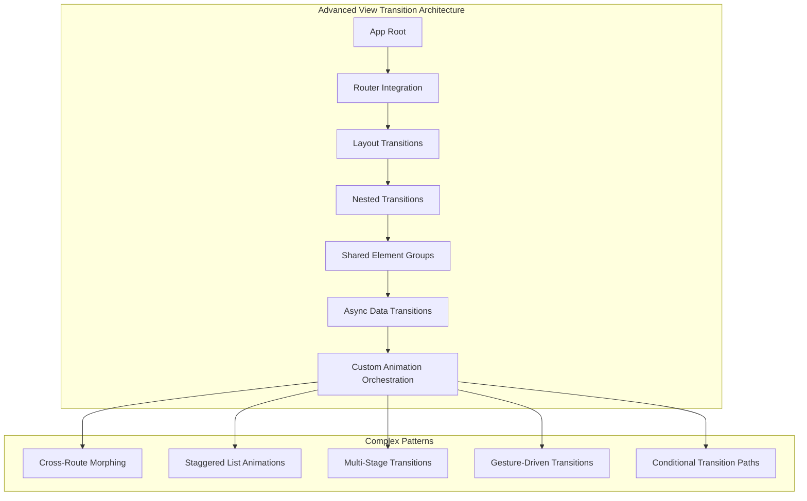
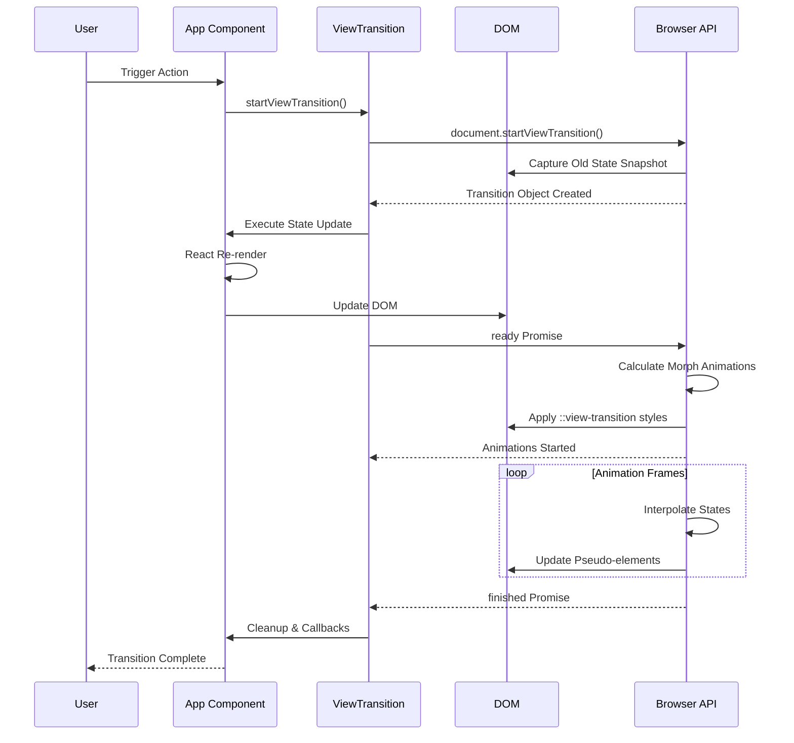

[Message created at 2026-09-26T12:04:21.790Z]The user wants more advanced examples and complex structures for React's View Transitions API. Let me load the mermaid skill first to create comprehensive diagrams for these advanced patterns.</think>Now I'll create comprehensive advanced examples with complex structures.

# Advanced React View Transitions: Complex Patterns

## Architecture Overview



## 1. Multi-Shared Element Cross-Route Transition

Complex e-commerce product page with multiple shared elements transitioning between list and detail views:

```jsx
import { ViewTransition, useViewTransition, Suspense } from 'react'
import { useParams, useNavigate } from 'react-router'

// Context for coordinating multiple shared elements
const TransitionContext = createContext(null)

function TransitionProvider({ children }) {
  const [activeTransitions, setActiveTransitions] = useState(new Set())

  const registerTransition = (name) => {
    setActiveTransitions((prev) => new Set([...prev, name]))
  }

  const unregisterTransition = (name) => {
    setActiveTransitions((prev) => {
      const next = new Set(prev)
      next.delete(name)
      return next
    })
  }

  return (
    <TransitionContext.Provider value={{ activeTransitions, registerTransition, unregisterTransition }}>
      {children}
    </TransitionContext.Provider>
  )
}

// Product List with multiple shared elements
function ProductList() {
  const navigate = useNavigate()
  const { startViewTransition } = useViewTransition()

  const products = useMemo(
    () => [
      {
        id: 1,
        name: 'Premium Headphones',
        price: 299,
        image: '/headphones.jpg',
        rating: 4.8,
        reviews: 1240,
        category: 'Audio'
      }
      // ... more products
    ],
    []
  )

  const handleProductClick = (product) => {
    startViewTransition(() => {
      navigate(`/product/${product.id}`)
    })
  }

  return (
    <div className='product-grid'>
      {products.map((product) => (
        <ProductCard key={product.id} product={product} onClick={() => handleProductClick(product)} />
      ))}
    </div>
  )
}

function ProductCard({ product, onClick }) {
  return (
    <article className='product-card' onClick={onClick}>
      {/* Image shared element */}
      <ViewTransition name={`product-image-${product.id}`} mode='position'>
        <div className='product-image-wrapper'>
          
        </div>
      </ViewTransition>

      {/* Title shared element */}
      <ViewTransition name={`product-title-${product.id}`} mode='layout'>
        <h3 className='product-title'>{product.name}</h3>
      </ViewTransition>

      {/* Price shared element */}
      <ViewTransition name={`product-price-${product.id}`} mode='position'>
        <span className='product-price'>${product.price}</span>
      </ViewTransition>

      {/* Rating badge - appears in both views */}
      <ViewTransition name={`product-rating-${product.id}`} mode='position'>
        <div className='rating-badge'>
          <span className='stars'>★ {product.rating}</span>
          <span className='review-count'>({product.reviews})</span>
        </div>
      </ViewTransition>

      {/* Category chip */}
      <ViewTransition name={`product-category-${product.id}`} mode='layout'>
        <span className='category-chip'>{product.category}</span>
      </ViewTransition>
    </article>
  )
}

// Product Detail with matching shared elements
function ProductDetail() {
  const { id } = useParams()
  const navigate = useNavigate()
  const [product, setProduct] = useState(null)
  const [selectedVariant, setSelectedVariant] = useState(null)
  const [activeTab, setActiveTab] = useState('description')

  useEffect(() => {
    // Simulate async data fetch
    fetchProduct(id).then(setProduct)
  }, [id])

  if (!product) return <ProductDetailSkeleton />

  return (
    <div className='product-detail-page'>
      {/* Header with back navigation */}
      <ViewTransition name='detail-header'>
        <header className='detail-header'>
          <button onClick={() => navigate(-1)} className='back-button'>
            ← Back
          </button>
        </header>
      </ViewTransition>

      <div className='detail-layout'>
        {/* Left column - Image gallery */}
        <ViewTransition name={`product-image-${product.id}`} mode='position'>
          <div className='image-gallery'>
            
            <ThumbnailStrip images={product.gallery} />
          </div>
        </ViewTransition>

        {/* Right column - Product info */}
        <div className='product-info'>
          {/* Title morphs from card to header */}
          <ViewTransition name={`product-title-${product.id}`} mode='layout'>
            <h1 className='detail-title'>{product.name}</h1>
          </ViewTransition>

          {/* Rating expands with more details */}
          <ViewTransition name={`product-rating-${product.id}`} mode='layout'>
            <div className='detail-rating'>
              <div className='rating-summary'>
                <span className='big-rating'>{product.rating}</span>
                <StarRating rating={product.rating} />
                <span className='total-reviews'>{product.reviews.toLocaleString()} reviews</span>
              </div>
              <RatingBreakdown distribution={product.ratingDistribution} />
            </div>
          </ViewTransition>

          {/* Price with variant selection */}
          <ViewTransition name={`product-price-${product.id}`} mode='layout'>
            <div className='price-section'>
              <span className='detail-price'>${product.price}</span>
              {product.variants && (
                <VariantSelector variants={product.variants} selected={selectedVariant} onSelect={setSelectedVariant} />
              )}
            </div>
          </ViewTransition>

          {/* Category with breadcrumb */}
          <ViewTransition name={`product-category-${product.id}`} mode='layout'>
            <nav className='breadcrumb'>
              <span>Shop</span>
              <span>{product.category}</span>
              <span>{product.subcategory}</span>
            </nav>
          </ViewTransition>

          {/* New elements - no transition, fade in */}
          <ViewTransition name='detail-actions'>
            <div className='action-buttons'>
              <AddToCartButton product={product} variant={selectedVariant} />
              <WishlistButton productId={product.id} />
            </div>
          </ViewTransition>

          {/* Tabbed content with nested transitions */}
          <ViewTransition name='detail-content'>
            <div className='detail-tabs'>
              <TabList tabs={['description', 'specs', 'reviews']} active={activeTab} onChange={setActiveTab} />
              <TabPanel active={activeTab}>
                {activeTab === 'description' && <ProductDescription content={product.description} />}
                {activeTab === 'specs' && <Specifications specs={product.specifications} />}
                {activeTab === 'reviews' && <ReviewList reviews={product.reviewList} />}
              </TabPanel>
            </div>
          </ViewTransition>
        </div>
      </div>
    </div>
  )
}
```

## 2. Staggered List with Dynamic Reordering

Complex list with drag-and-drop, filtering, and staggered animations:

```jsx
import { ViewTransition, useViewTransition } from 'react'
import { useDrag, useDrop } from 'react-dnd'

function StaggeredTaskBoard() {
  const [tasks, setTasks] = useState([])
  const [filter, setFilter] = useState('all')
  const [sortBy, setSortBy] = useState('priority')
  const { startViewTransition } = useViewTransition()

  // Compute filtered and sorted tasks
  const displayedTasks = useMemo(() => {
    let result = [...tasks]

    if (filter !== 'all') {
      result = result.filter((t) => t.status === filter)
    }

    result.sort((a, b) => {
      if (sortBy === 'priority') return b.priority - a.priority
      if (sortBy === 'dueDate') return new Date(a.dueDate) - new Date(b.dueDate)
      return a.title.localeCompare(b.title)
    })

    return result
  }, [tasks, filter, sortBy])

  // Apply filter/sort with transition
  const applyChanges = (newFilter, newSort) => {
    startViewTransition(() => {
      setFilter(newFilter)
      setSortBy(newSort)
    })
  }

  // Handle drag and drop reordering
  const moveTask = (dragIndex, hoverIndex) => {
    const draggedTask = displayedTasks[dragIndex]

    startViewTransition(() => {
      setTasks((prev) => {
        const newTasks = [...prev]
        const [removed] = newTasks.splice(
          prev.findIndex((t) => t.id === draggedTask.id),
          1
        )
        const insertIndex = prev.findIndex((t) => t.id === displayedTasks[hoverIndex].id)
        newTasks.splice(insertIndex, 0, removed)
        return newTasks
      })
    })
  }

  return (
    <div className='task-board'>
      <ViewTransition name='board-header'>
        <header className='board-header'>
          <h1>Task Board</h1>
          <FilterBar filter={filter} sortBy={sortBy} onChange={applyChanges} />
        </header>
      </ViewTransition>

      <div className='task-columns'>
        {['todo', 'in-progress', 'done'].map((status) => (
          <TaskColumn
            key={status}
            status={status}
            tasks={displayedTasks.filter((t) => t.status === status)}
            onMoveTask={moveTask}
          />
        ))}
      </div>
    </div>
  )
}

function TaskColumn({ status, tasks, onMoveTask }) {
  const [{ isOver }, dropRef] = useDrop({
    accept: 'TASK',
    drop: (item, monitor) => {
      const didDrop = monitor.didDrop()
      if (didDrop) return

      // Move to end of column
      onMoveTask(item.index, tasks.length)
    },
    collect: (monitor) => ({
      isOver: monitor.isOver({ shallow: true })
    })
  })

  return (
    <ViewTransition name={`column-${status}`}>
      <div ref={dropRef} className={`task-column ${isOver ? 'drag-over' : ''}`}>
        <h2 className='column-header'>
          {status.replace('-', ' ').toUpperCase()}
          <span className='task-count'>{tasks.length}</span>
        </h2>

        <div className='task-list'>
          {tasks.map((task, index) => (
            <DraggableTask key={task.id} task={task} index={index} onMove={onMoveTask} />
          ))}
        </div>
      </div>
    </ViewTransition>
  )
}

function DraggableTask({ task, index, onMove }) {
  const ref = useRef(null)

  const [{ isDragging }, dragRef] = useDrag({
    type: 'TASK',
    item: { id: task.id, index },
    collect: (monitor) => ({
      isDragging: monitor.isDragging()
    })
  })

  const [, dropRef] = useDrop({
    accept: 'TASK',
    hover: (item, monitor) => {
      if (!ref.current) return

      const dragIndex = item.index
      const hoverIndex = index

      if (dragIndex === hoverIndex) return

      const hoverBoundingRect = ref.current.getBoundingClientRect()
      const hoverMiddleY = (hoverBoundingRect.bottom - hoverBoundingRect.top) / 2
      const clientOffset = monitor.getClientOffset()
      const hoverClientY = clientOffset.y - hoverBoundingRect.top

      if (dragIndex < hoverIndex && hoverClientY < hoverMiddleY) return
      if (dragIndex > hoverIndex && hoverClientY > hoverMiddleY) return

      onMove(dragIndex, hoverIndex)
      item.index = hoverIndex
    }
  })

  dragRef(dropRef(ref))

  // Calculate stagger delay based on position
  const staggerDelay = index * 50 // ms

  return (
    <ViewTransition
      name={`task-${task.id}`}
      mode='layout'
      style={{
        viewTransitionDelay: `${staggerDelay}ms`,
        opacity: isDragging ? 0.5 : 1
      }}>
      <div ref={ref} className={`task-card ${task.priority}`}>
        <ViewTransition name={`task-header-${task.id}`}>
          <div className='task-header'>
            <PriorityIndicator priority={task.priority} />
            <TaskMenu taskId={task.id} />
          </div>
        </ViewTransition>

        <ViewTransition name={`task-title-${task.id}`}>
          <h3 className='task-title'>{task.title}</h3>
        </ViewTransition>

        <ViewTransition name={`task-meta-${task.id}`}>
          <div className='task-meta'>
            <DueDate date={task.dueDate} />
            <AssigneeAvatar user={task.assignee} />
            <TagList tags={task.tags} />
          </div>
        </ViewTransition>

        <ViewTransition name={`task-progress-${task.id}`}>
          <ProgressBar progress={task.progress} />
        </ViewTransition>
      </div>
    </ViewTransition>
  )
}
```

## 3. Multi-Stage Async Transition with Loading States

Complex transition that handles async data loading with intermediate states:

```jsx
import { ViewTransition, useViewTransition, Suspense, useTransition } from 'react'
import { ErrorBoundary } from 'react-error-boundary'

function AsyncViewTransitionManager() {
  const [viewState, setViewState] = useState({
    phase: 'idle', // idle | loading | error | success
    data: null,
    error: null,
    targetView: null
  })

  const { startViewTransition } = useViewTransition()
  const [isPending, startTransition] = useTransition()

  // Orchestrate multi-stage transition
  const navigateWithData = async (targetView, dataFetcher) => {
    // Stage 1: Capture current state
    const snapshot = document.documentElement.getBoundingClientRect()

    startViewTransition(async () => {
      // Stage 2: Show loading state immediately
      setViewState({
        phase: 'loading',
        data: null,
        error: null,
        targetView
      })

      try {
        // Stage 3: Fetch data with timeout
        const data = await Promise.race([
          dataFetcher(),
          new Promise((_, reject) => setTimeout(() => reject(new Error('Timeout')), 10000))
        ])

        // Stage 4: Transition to success state
        setViewState({
          phase: 'success',
          data,
          error: null,
          targetView
        })
      } catch (error) {
        // Stage 5: Handle error with fallback
        setViewState({
          phase: 'error',
          data: null,
          error,
          targetView
        })
      }
    })
  }

  return (
    <div className='async-transition-container'>
      <ViewTransition name='main-content'>
        {viewState.phase === 'idle' && <Dashboard onNavigate={navigateWithData} />}

        {viewState.phase === 'loading' && <LoadingTransition targetView={viewState.targetView} />}

        {viewState.phase === 'error' && (
          <ErrorTransition
            error={viewState.error}
            onRetry={() => navigateWithData(viewState.targetView, viewState.targetView.dataFetcher)}
            onCancel={() => setViewState({ phase: 'idle', data: null, error: null, targetView: null })}
          />
        )}

        {viewState.phase === 'success' && <DataView view={viewState.targetView} data={viewState.data} />}
      </ViewTransition>
    </div>
  )
}

// Loading state with skeleton that morphs into content
function LoadingTransition({ targetView }) {
  return (
    <div className='loading-transition'>
      <ViewTransition name='loading-header'>
        <SkeletonHeader title={targetView.title} />
      </ViewTransition>

      <ViewTransition name='loading-content'>
        <div className='skeleton-grid'>
          {Array.from({ length: 6 }).map((_, i) => (
            <SkeletonCard key={i} delay={i * 100} />
          ))}
        </div>
      </ViewTransition>

      <ViewTransition name='loading-spinner'>
        <div className='loading-indicator'>
          <ProgressSpinner />
          <span>Loading {targetView.title}...</span>
        </div>
      </ViewTransition>
    </div>
  )
}

// Error state with recovery options
function ErrorTransition({ error, onRetry, onCancel }) {
  return (
    <ViewTransition name='error-state'>
      <div className='error-transition'>
        <ViewTransition name='error-icon'>
          <ErrorIcon size='large' />
        </ViewTransition>

        <ViewTransition name='error-message'>
          <div className='error-content'>
            <h2>Failed to load</h2>
            <p>{error.message}</p>
            <div className='error-actions'>
              <button onClick={onRetry} className='retry-btn'>
                Try Again
              </button>
              <button onClick={onCancel} className='cancel-btn'>
                Go Back
              </button>
            </div>
          </div>
        </ViewTransition>
      </div>
    </ViewTransition>
  )
}
```

## 4. Gesture-Driven Interactive Transition

Swipeable cards with physics-based animations:

```jsx
import { ViewTransition, useViewTransition } from 'react'
import { useSpring, useMotionValue, useTransform } from 'framer-motion'

function GestureDrivenGallery() {
  const [items, setItems] = useState([])
  const [activeIndex, setActiveIndex] = useState(0)
  const { startViewTransition } = useViewTransition()
  const containerRef = useRef(null)

  const x = useMotionValue(0)
  const rotate = useTransform(x, [-200, 200], [-15, 15])
  const opacity = useTransform(x, [-200, -100, 0, 100, 200], [0, 1, 1, 1, 0])

  const handleDragEnd = (event, info) => {
    const threshold = 100

    if (Math.abs(info.offset.x) > threshold) {
      const direction = info.offset.x > 0 ? -1 : 1
      const newIndex = activeIndex + direction

      if (newIndex >= 0 && newIndex < items.length) {
        startViewTransition(() => {
          setActiveIndex(newIndex)
        })
      }
    }
  }

  return (
    <div className='gesture-gallery' ref={containerRef}>
      <ViewTransition name='gallery-header'>
        <header className='gallery-header'>
          <h1>Swipe to Explore</h1>
          <ProgressIndicator current={activeIndex + 1} total={items.length} />
        </header>
      </ViewTransition>

      <div className='card-stack'>
        {/* Previous card (preview) */}
        {activeIndex > 0 && <PreviewCard item={items[activeIndex - 1]} position='left' />}

        {/* Active card with gesture handling */}
        <ViewTransition name={`card-${items[activeIndex]?.id}`} mode='layout'>
          <motion.div
            className='active-card'
            style={{ x, rotate, opacity }}
            drag='x'
            dragConstraints={{ left: 0, right: 0 }}
            dragElastic={0.2}
            onDragEnd={handleDragEnd}
            whileTap={{ scale: 0.98 }}>
            <CardContent item={items[activeIndex]} />
          </motion.div>
        </ViewTransition>

        {/* Next card (preview) */}
        {activeIndex < items.length - 1 && <PreviewCard item={items[activeIndex + 1]} position='right' />}
      </div>

      {/* Detail panel that expands on tap */}
      <ViewTransition name='detail-panel'>
        <ExpandableDetail item={items[activeIndex]} />
      </ViewTransition>
    </div>
  )
}

function CardContent({ item }) {
  const [isExpanded, setIsExpanded] = useState(false)

  return (
    <div className={`card-content ${isExpanded ? 'expanded' : ''}`}>
      <ViewTransition name={`card-image-${item.id}`}>
         setIsExpanded(!isExpanded)} />
      </ViewTransition>

      <ViewTransition name={`card-info-${item.id}`}>
        <div className='card-info'>
          <h2>{item.title}</h2>
          <p className='card-description'>{item.description}</p>

          <ViewTransition name={`card-actions-${item.id}`}>
            <div className='card-actions'>
              <LikeButton itemId={item.id} />
              <ShareButton item={item} />
              <SaveButton itemId={item.id} />
            </div>
          </ViewTransition>
        </div>
      </ViewTransition>

      {isExpanded && (
        <ViewTransition name='expanded-content'>
          <div className='expanded-section'>
            <h3>More Details</h3>
            <p>{item.fullDescription}</p>
            <MetadataTable metadata={item.metadata} />
          </div>
        </ViewTransition>
      )}
    </div>
  )
}
```

## 5. Conditional Transition Paths

Dynamic routing with different transition strategies based on context:

```jsx
import { ViewTransition, useViewTransition } from 'react'
import { useLocation, useNavigationType } from 'react-router'

// Transition strategy configuration
const TRANSITION_STRATEGIES = {
  // Default: Standard morph
  default: { mode: 'layout', duration: 300 },

  // Fast: For frequent navigation
  fast: { mode: 'position', duration: 150 },

  // Dramatic: For major context switches
  dramatic: { mode: 'layout', duration: 600 },

  // None: Disable for accessibility
  none: { mode: null, duration: 0 }
}

function AdaptiveTransitionRouter() {
  const location = useLocation()
  const navigationType = useNavigationType()
  const { startViewTransition } = useViewTransition()
  const [strategy, setStrategy] = useState('default')

  // Determine transition strategy based on navigation context
  useEffect(() => {
    const path = location.pathname
    const prevPath = location.state?.from

    // Different strategies for different route patterns
    if (path.includes('/quick/')) {
      setStrategy('fast')
    } else if (path.includes('/onboarding/')) {
      setStrategy('dramatic')
    } else if (navigationType === 'POP') {
      // Back button - reverse animation
      setStrategy('fast')
    } else {
      setStrategy('default')
    }
  }, [location, navigationType])

  const applyTransition = (updateFn) => {
    if (strategy === 'none') {
      updateFn()
      return
    }

    startViewTransition(() => {
      updateFn()
    })
  }

  return (
    <TransitionStrategyContext.Provider value={{ strategy, applyTransition }}>
      <ViewTransition name='app-root'>
        <Routes>
          <Route path='/' element={<Home />} />
          <Route path='/quick/:id' element={<QuickView />} />
          <Route path='/onboarding/*' element={<OnboardingFlow />} />
          <Route path='/product/:id' element={<ProductDetail />} />
          <Route path='*' element={<NotFound />} />
        </Routes>
      </ViewTransition>
    </TransitionStrategyContext.Provider>
  )
}

// Component that adapts its transition based on strategy
function AdaptiveViewTransition({ name, children, preferredMode = 'layout' }) {
  const { strategy } = useContext(TransitionStrategyContext)
  const config = TRANSITION_STRATEGIES[strategy]

  if (config.mode === null) {
    return children
  }

  return (
    <ViewTransition
      name={name}
      mode={config.mode || preferredMode}
      style={{
        viewTransitionDuration: `${config.duration}ms`
      }}>
      {children}
    </ViewTransition>
  )
}

// Complex wizard with step transitions
function OnboardingFlow() {
  const [step, setStep] = useState(1)
  const [formData, setFormData] = useState({})
  const { applyTransition } = useContext(TransitionStrategyContext)

  const steps = [
    { id: 1, title: 'Welcome', component: WelcomeStep },
    { id: 2, title: 'Profile', component: ProfileStep },
    { id: 3, title: 'Preferences', component: PreferencesStep },
    { id: 4, title: 'Complete', component: CompleteStep }
  ]

  const currentStep = steps.find((s) => s.id === step)
  const StepComponent = currentStep.component

  const goToStep = (newStep) => {
    applyTransition(() => setStep(newStep))
  }

  return (
    <div className='onboarding-flow'>
      {/* Progress indicator with morphing segments */}
      <ViewTransition name='progress-bar'>
        <div className='step-indicator'>
          {steps.map((s, index) => (
            <ViewTransition key={s.id} name={`step-${s.id}`} mode='layout'>
              <div className={`step-segment ${s.id === step ? 'active' : s.id < step ? 'completed' : ''}`}>
                <ViewTransition name={`step-number-${s.id}`}>
                  <span className='step-number'>{s.id < step ? '✓' : s.id}</span>
                </ViewTransition>
                <ViewTransition name={`step-title-${s.id}`}>
                  <span className='step-title'>{s.title}</span>
                </ViewTransition>
              </div>
            </ViewTransition>
          ))}
        </div>
      </ViewTransition>

      {/* Step content with cross-fade */}
      <ViewTransition name='step-content'>
        <div className='step-wrapper'>
          <StepComponent
            data={formData}
            onChange={(data) => setFormData((prev) => ({ ...prev, ...data }))}
            onNext={() => goToStep(step + 1)}
            onBack={() => goToStep(step - 1)}
          />
        </div>
      </ViewTransition>

      {/* Navigation with conditional transitions */}
      <ViewTransition name='step-navigation'>
        <div className='step-navigation'>
          {step > 1 && (
            <button onClick={() => goToStep(step - 1)} className='nav-button back'>
              Back
            </button>
          )}
          {step < steps.length && (
            <button onClick={() => goToStep(step + 1)} className='nav-button next'>
              Continue
            </button>
          )}
        </div>
      </ViewTransition>
    </div>
  )
}
```

## 6. Nested Transition Orchestration

Managing multiple levels of transitions with proper timing:

```jsx
import { ViewTransition, useViewTransition } from 'react'

// Custom hook for orchestrating nested transitions
function useOrchestratedTransitions() {
  const { startViewTransition } = useViewTransition()
  const [pendingTransitions, setPendingTransitions] = useState([])

  const orchestrate = async (transitions) => {
    // Sort by priority
    const sorted = transitions.sort((a, b) => (a.priority || 0) - (b.priority || 0))

    // Group by phase
    const phases = groupBy(sorted, 'phase')

    for (const [phase, items] of Object.entries(phases)) {
      await Promise.all(
        items.map(
          (item) =>
            new Promise((resolve) => {
              startViewTransition(() => {
                item.callback()
                // Allow time for DOM update
                requestAnimationFrame(() => {
                  setTimeout(resolve, item.delay || 0)
                })
              })
            })
        )
      )
    }
  }

  return { orchestrate }
}

function ComplexDashboard() {
  const [layout, setLayout] = useState('grid')
  const [sidebarCollapsed, setSidebarCollapsed] = useState(false)
  const [activeWidget, setActiveWidget] = useState(null)
  const { orchestrate } = useOrchestratedTransitions()

  const handleLayoutChange = (newLayout) => {
    orchestrate([
      // Phase 1: Collapse sidebar first
      {
        phase: 1,
        priority: 1,
        callback: () => setSidebarCollapsed(true),
        delay: 100
      },
      // Phase 2: Change layout
      {
        phase: 2,
        priority: 2,
        callback: () => setLayout(newLayout),
        delay: 200
      },
      // Phase 3: Expand sidebar
      {
        phase: 3,
        priority: 3,
        callback: () => setSidebarCollapsed(false),
        delay: 100
      }
    ])
  }

  return (
    <div className={`dashboard ${layout}`}>
      <ViewTransition name='sidebar'>
        <Sidebar collapsed={sidebarCollapsed} onToggle={() => setSidebarCollapsed(!sidebarCollapsed)} />
      </ViewTransition>

      <main className='dashboard-content'>
        <ViewTransition name='dashboard-header'>
          <DashboardHeader layout={layout} onLayoutChange={handleLayoutChange} />
        </ViewTransition>

        <ViewTransition name='widget-grid'>
          <div className='widget-container'>
            {widgets.map((widget) => (
              <Widget
                key={widget.id}
                widget={widget}
                layout={layout}
                isActive={activeWidget === widget.id}
                onActivate={() => setActiveWidget(widget.id)}
              />
            ))}
          </div>
        </ViewTransition>
      </main>

      {activeWidget && (
        <ViewTransition name='widget-modal'>
          <WidgetModal widgetId={activeWidget} onClose={() => setActiveWidget(null)} />
        </ViewTransition>
      )}
    </div>
  )
}

function Widget({ widget, layout, isActive, onActivate }) {
  return (
    <ViewTransition name={`widget-${widget.id}`} mode={layout === 'grid' ? 'layout' : 'position'}>
      <div className={`widget ${isActive ? 'active' : ''} ${widget.size}`} onClick={onActivate}>
        {/* Widget header - always visible */}
        <ViewTransition name={`widget-header-${widget.id}`}>
          <div className='widget-header'>
            <Icon type={widget.icon} />
            <h3>{widget.title}</h3>
            <WidgetMenu widgetId={widget.id} />
          </div>
        </ViewTransition>

        {/* Widget content - morphs based on layout */}
        <ViewTransition name={`widget-content-${widget.id}`}>
          <div className='widget-content'>
            {widget.type === 'chart' && <ChartWidget data={widget.data} layout={layout} />}
            {widget.type === 'list' && <ListWidget items={widget.items} layout={layout} />}
            {widget.type === 'metric' && <MetricWidget value={widget.value} layout={layout} />}
          </div>
        </ViewTransition>

        {/* Footer - only in expanded mode */}
        {layout === 'list' && (
          <ViewTransition name={`widget-footer-${widget.id}`}>
            <div className='widget-footer'>
              <LastUpdated timestamp={widget.updatedAt} />
              <ActionButtons actions={widget.actions} />
            </div>
          </ViewTransition>
        )}
      </div>
    </ViewTransition>
  )
}
```

## Transition Lifecycle Sequence



These advanced patterns demonstrate how to build complex, production-ready view transitions that handle real-world scenarios like async data, error states, user gestures, and multi-step orchestration.
