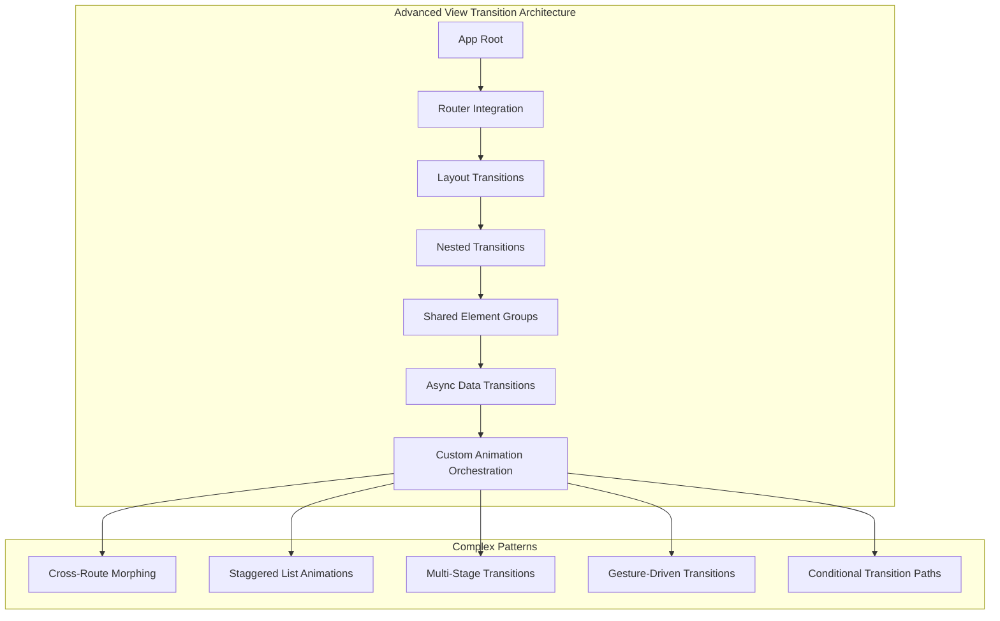
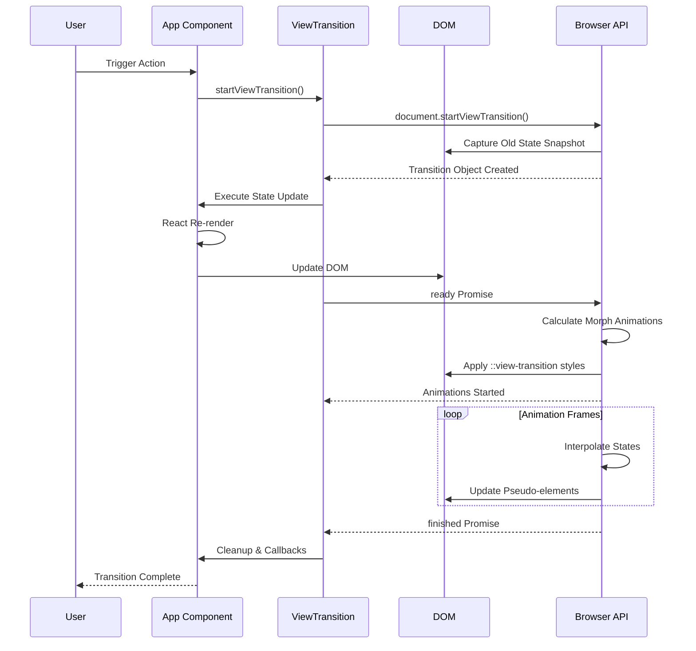

[Message created at 2026-09-26T12:04:21.790Z]The user wants more advanced examples and complex structures for React's View Transitions API. Let me load the mermaid skill first to create comprehensive diagrams for these advanced patterns.</think>Now I'll create comprehensive advanced examples with complex structures.

# Advanced React View Transitions: Complex Patterns

## Architecture Overview



## 1. Multi-Shared Element Cross-Route Transition

Complex e-commerce product page with multiple shared elements transitioning between list and detail views:

```btsx

// useViewTransition: no Octane equivalent, dropped from react
import { useParams, useNavigate } from "@octanejs/remix-router";
import { ViewTransition, Suspense } from "octane";
module
  // Context for coordinating multiple shared elements
  // Context for coordinating multiple shared elements
  const TransitionContext = createContext(null);
component TransitionProvider
  setup
    const [activeTransitions, setActiveTransitions] = useState(new Set());

    const registerTransition = (name) => {
      setActiveTransitions((prev) => new Set([...prev, name]));
    };

    const unregisterTransition = (name) => {
      setActiveTransitions((prev) => {
        const next = new Set(prev);
        next.delete(name);
        return next;
      });
    };
  TransitionContext.Provider(value={{ activeTransitions, registerTransition, unregisterTransition }}) #{children}
// Product List with multiple shared elements
component ProductList
  setup
    const navigate = useNavigate();
    const { startViewTransition } = useViewTransition();

    const products = useMemo(() => [
      {
        id: 1,
        name: "Premium Headphones",
        price: 299,
        image: "/headphones.jpg",
        rating: 4.8,
        reviews: 1240,
        category: "Audio"
      }
      // ... more products
    ], []);

    const handleProductClick = (product) => {
      startViewTransition(() => {
        navigate(`/product/${product.id}`);
      });
    };
  .product-grid
    each product in products key product.id
      ProductCard(product={product} onClick={() => handleProductClick(product)})
component ProductCard
  article.product-card(onClick={onClick})
    ViewTransition(name={`product-image-${product.id}`} mode="position")
      .product-image-wrapper
        img.product-image(src={product.image} alt={product.name})
    ViewTransition(name={`product-title-${product.id}`} mode="layout")
      h3.product-title #{product.name}
    ViewTransition(name={`product-price-${product.id}`} mode="position")
      span.product-price $#{product.price}
    ViewTransition(name={`product-rating-${product.id}`} mode="position")
      .rating-badge
        span.stars ★ #{product.rating}
        span.review-count (#{product.reviews})
    ViewTransition(name={`product-category-${product.id}`} mode="layout")
      span.category-chip #{product.category}
// Product Detail with matching shared elements
component ProductDetail
  setup
    const { id } = useParams();
    const navigate = useNavigate();
    const [product, setProduct] = useState(null);
    const [selectedVariant, setSelectedVariant] = useState(null);
    const [activeTab, setActiveTab] = useState("description");

    useEffect(() => {
      // Simulate async data fetch
      fetchProduct(id).then(setProduct);
    }, [id]);
  if !product
    ProductDetailSkeleton
  else
    .product-detail-page
      ViewTransition(name="detail-header")
        header.detail-header
          button.back-button(onClick={() => navigate(-1)}) ← Back
      .detail-layout
        ViewTransition(name={`product-image-${product.id}`} mode="position")
          .image-gallery
            img.detail-image(src={product.image} alt={product.name})
            ThumbnailStrip(images={product.gallery})
        .product-info
          ViewTransition(name={`product-title-${product.id}`} mode="layout")
            h1.detail-title #{product.name}
          ViewTransition(name={`product-rating-${product.id}`} mode="layout")
            .detail-rating
              .rating-summary
                span.big-rating #{product.rating}
                StarRating(rating={product.rating})
                span.total-reviews #{product.reviews.toLocaleString()} reviews
              RatingBreakdown(distribution={product.ratingDistribution})
          ViewTransition(name={`product-price-${product.id}`} mode="layout")
            .price-section
              span.detail-price $#{product.price}
              if product.variants
                VariantSelector(
                  ~ variants={product.variants}
                  ~ selected={selectedVariant}
                  ~ onSelect={setSelectedVariant}
                  ~ )
          ViewTransition(name={`product-category-${product.id}`} mode="layout")
            nav.breadcrumb
              span Shop
              span #{product.category}
              span #{product.subcategory}
          ViewTransition(name="detail-actions")
            .action-buttons
              AddToCartButton(product={product} variant={selectedVariant})
              WishlistButton(productId={product.id})
          ViewTransition(name="detail-content")
            .detail-tabs
              TabList(
                ~ tabs={["description", "specs", "reviews"]}
                ~ active={activeTab}
                ~ onChange={setActiveTab}
                ~ )
              TabPanel(active={activeTab})
                if activeTab === "description"
                  ProductDescription(content={product.description})
                if activeTab === "specs"
                  Specifications(specs={product.specifications})
                if activeTab === "reviews"
                  ReviewList(reviews={product.reviewList})
```

## 2. Staggered List with Dynamic Reordering

Complex list with drag-and-drop, filtering, and staggered animations:

```btsx

// useViewTransition: no Octane equivalent, dropped from react
import { useDrag, useDrop } from "react-dnd";
import { ViewTransition } from "octane";
component StaggeredTaskBoard
  setup
    const [tasks, setTasks] = useState([]);
    const [filter, setFilter] = useState("all");
    const [sortBy, setSortBy] = useState("priority");
    const { startViewTransition } = useViewTransition();

    const displayedTasks = useMemo(() => {
      let result = [...tasks];
      if (filter !== "all") {
        result = result.filter((t) => t.status === filter);
      }
      result.sort((a, b) => {
        if (sortBy === "priority")
          return b.priority - a.priority;
        if (sortBy === "dueDate")
          return new Date(a.dueDate) - new Date(b.dueDate);
        return a.title.localeCompare(b.title);
      });
      return result;
    }, [tasks, filter, sortBy]);

    // Apply filter/sort with transition
    const applyChanges = (newFilter, newSort) => {
      startViewTransition(() => {
        setFilter(newFilter);
        setSortBy(newSort);
      });
    };

    // Handle drag and drop reordering
    const moveTask = (dragIndex, hoverIndex) => {
      const draggedTask = displayedTasks[dragIndex];
      startViewTransition(() => {
        setTasks((prev) => {
          const newTasks = [...prev];
          const [removed] = newTasks.splice(prev.findIndex((t) => t.id === draggedTask.id), 1);
          const insertIndex = prev.findIndex((t) => t.id === displayedTasks[hoverIndex].id);
          newTasks.splice(insertIndex, 0, removed);
          return newTasks;
        });
      });
    };
  .task-board
    ViewTransition(name="board-header")
      header.board-header
        h1 Task Board
        FilterBar(filter={filter} sortBy={sortBy} onChange={applyChanges})
    .task-columns
      each status in ["todo", "in-progress", "done"] key status
        TaskColumn(
          ~ status={status}
          ~ tasks={displayedTasks.filter((t) => t.status === status)}
          ~ onMoveTask={moveTask}
          ~ )
component TaskColumn
  setup
    const [{ isOver }, dropRef] = useDrop({
      accept: "TASK",
      drop: (item, monitor) => {
        const didDrop = monitor.didDrop();
        if (didDrop)
          return;
        // Move to end of column
        onMoveTask(item.index, tasks.length);
      },
      collect: (monitor) => ({
        isOver: monitor.isOver({ shallow: true })
      })
    });
  ViewTransition(name={`column-${status}`})
    div(ref={dropRef} className={`task-column ${isOver ? "drag-over" : ""}`})
      h2.column-header
        | #{status.replace("-", " ").toUpperCase()}
        span.task-count #{tasks.length}
      .task-list
        each task, index in tasks key task.id
          DraggableTask(task={task} index={index} onMove={onMoveTask})
component DraggableTask
  setup
    const ref = useRef(null);

    const [{ isDragging }, dragRef] = useDrag({
      type: "TASK",
      item: { id: task.id, index },
      collect: (monitor) => ({
        isDragging: monitor.isDragging()
      })
    });

    const [, dropRef] = useDrop({
      accept: "TASK",
      hover: (item, monitor) => {
        if (!ref.current)
          return;
        const dragIndex = item.index;
        const hoverIndex = index;
        if (dragIndex === hoverIndex)
          return;
        const hoverBoundingRect = ref.current.getBoundingClientRect();
        const hoverMiddleY = (hoverBoundingRect.bottom - hoverBoundingRect.top) / 2;
        const clientOffset = monitor.getClientOffset();
        const hoverClientY = clientOffset.y - hoverBoundingRect.top;
        if (dragIndex < hoverIndex && hoverClientY < hoverMiddleY)
          return;
        if (dragIndex > hoverIndex && hoverClientY > hoverMiddleY)
          return;
        onMove(dragIndex, hoverIndex);
        item.index = hoverIndex;
      }
    });

    dragRef(dropRef(ref));

    // Calculate stagger delay based on position
    const staggerDelay = index * 50; // ms
    ;
  ViewTransition(
    ~ name={`task-${task.id}`}
    ~ mode="layout"
    ~ style={{
    ~ viewTransitionDelay: `${staggerDelay}ms`,
    ~ opacity: isDragging ? 0.5 : 1
    ~ }}
    ~ )
    div(ref={ref} className={`task-card ${task.priority}`})
      ViewTransition(name={`task-header-${task.id}`})
        .task-header
          PriorityIndicator(priority={task.priority})
          TaskMenu(taskId={task.id})
      ViewTransition(name={`task-title-${task.id}`})
        h3.task-title #{task.title}
      ViewTransition(name={`task-meta-${task.id}`})
        .task-meta
          DueDate(date={task.dueDate})
          AssigneeAvatar(user={task.assignee})
          TagList(tags={task.tags})
      ViewTransition(name={`task-progress-${task.id}`})
        ProgressBar(progress={task.progress})
```

## 3. Multi-Stage Async Transition with Loading States

Complex transition that handles async data loading with intermediate states:

```btsx

// useViewTransition: no Octane equivalent, dropped from react
import { ErrorBoundary } from "@octanejs/react-error-boundary";
import { ViewTransition, Suspense, useTransition } from "octane";
component AsyncViewTransitionManager
  setup
    const [viewState, setViewState] = useState({
      phase: "idle", // idle | loading | error | success
      data: null,
      error: null,
      targetView: null
    });

    const { startViewTransition } = useViewTransition();
    const [isPending, startTransition] = useTransition();

    const navigateWithData = async (targetView, dataFetcher) => {
      // Stage 1: Capture current state
      const snapshot = document.documentElement.getBoundingClientRect();
      startViewTransition(async () => {
        // Stage 2: Show loading state immediately
        setViewState({
          phase: "loading",
          data: null,
          error: null,
          targetView
        });
        try {
          // Stage 3: Fetch data with timeout
          const data = await Promise.race([
            dataFetcher(),
            new Promise((_, reject) => setTimeout(() => reject(new Error("Timeout")), 10000))
          ]);
          // Stage 4: Transition to success state
          setViewState({
            phase: "success",
            data,
            error: null,
            targetView
          });
        }
        catch (error) {
          // Stage 5: Handle error with fallback
          setViewState({
            phase: "error",
            data: null,
            error,
            targetView
          });
        }
      });
    };
  .async-transition-container
    ViewTransition(name="main-content")
      if viewState.phase === "idle"
        Dashboard(onNavigate={navigateWithData})
      if viewState.phase === "loading"
        LoadingTransition(targetView={viewState.targetView})
      if viewState.phase === "error"
        ErrorTransition(
          ~ error={viewState.error}
          ~ onRetry={() => navigateWithData(viewState.targetView, viewState.targetView.dataFetcher)}
          ~ onCancel={() => setViewState({ phase: "idle", data: null, error: null, targetView: null })}
          ~ )
      if viewState.phase === "success"
        DataView(view={viewState.targetView} data={viewState.data})
// Loading state with skeleton that morphs into content
component LoadingTransition
  .loading-transition
    ViewTransition(name="loading-header")
      SkeletonHeader(title={targetView.title})
    ViewTransition(name="loading-content")
      .skeleton-grid
        each _, i in Array.from({ length: 6 }) key i
          SkeletonCard(delay={i * 100})
    ViewTransition(name="loading-spinner")
      .loading-indicator
        ProgressSpinner
        span Loading #{targetView.title}...
// Error state with recovery options
component ErrorTransition
  ViewTransition(name="error-state")
    .error-transition
      ViewTransition(name="error-icon")
        ErrorIcon(size="large")
      ViewTransition(name="error-message")
        .error-content
          h2 Failed to load
          p #{error.message}
          .error-actions
            button.retry-btn(onClick={onRetry}) Try Again
            button.cancel-btn(onClick={onCancel}) Go Back
```

## 4. Gesture-Driven Interactive Transition

Swipeable cards with physics-based animations:

```btsx

// useViewTransition: no Octane equivalent, dropped from react
import { useSpring, useMotionValue, useTransform } from "@octanejs/motion";
import { ViewTransition } from "octane";
component GestureDrivenGallery
  setup
    const [items, setItems] = useState([]);
    const [activeIndex, setActiveIndex] = useState(0);
    const { startViewTransition } = useViewTransition();
    const containerRef = useRef(null);
    const x = useMotionValue(0);
    const rotate = useTransform(x, [-200, 200], [-15, 15]);
    const opacity = useTransform(x, [-200, -100, 0, 100, 200], [0, 1, 1, 1, 0]);

    const handleDragEnd = (event, info) => {
      const threshold = 100;
      if (Math.abs(info.offset.x) > threshold) {
        const direction = info.offset.x > 0 ? -1 : 1;
        const newIndex = activeIndex + direction;
        if (newIndex >= 0 && newIndex < items.length) {
          startViewTransition(() => {
            setActiveIndex(newIndex);
          });
        }
      }
    };
  .gesture-gallery(ref={containerRef})
    ViewTransition(name="gallery-header")
      header.gallery-header
        h1 Swipe to Explore
        ProgressIndicator(current={activeIndex + 1} total={items.length})
    .card-stack
      if activeIndex > 0
        PreviewCard(item={items[activeIndex - 1]} position="left")
      ViewTransition(name={`card-${items[activeIndex]?.id}`} mode="layout")
        motion.div(
          ~ className="active-card"
          ~ style={{ x, rotate, opacity }}
          ~ drag="x"
          ~ dragConstraints={{ left: 0, right: 0 }}
          ~ dragElastic={0.2}
          ~ onDragEnd={handleDragEnd}
          ~ whileTap={{ scale: 0.98 }}
          ~ )
          CardContent(item={items[activeIndex]})
      if activeIndex < items.length - 1
        PreviewCard(item={items[activeIndex + 1]} position="right")
    ViewTransition(name="detail-panel")
      ExpandableDetail(item={items[activeIndex]})
component CardContent
  setup const [isExpanded, setIsExpanded] = useState(false);
  div(className={`card-content ${isExpanded ? "expanded" : ""}`})
    ViewTransition(name={`card-image-${item.id}`})
      img.card-image(src={item.image} alt={item.title} onClick={() => setIsExpanded(!isExpanded)})
    ViewTransition(name={`card-info-${item.id}`})
      .card-info
        h2 #{item.title}
        p.card-description #{item.description}
        ViewTransition(name={`card-actions-${item.id}`})
          .card-actions
            LikeButton(itemId={item.id})
            ShareButton(item={item})
            SaveButton(itemId={item.id})
    if isExpanded
      ViewTransition(name="expanded-content")
        .expanded-section
          h3 More Details
          p #{item.fullDescription}
          MetadataTable(metadata={item.metadata})
```

## 5. Conditional Transition Paths

Dynamic routing with different transition strategies based on context:

```btsx

// useViewTransition: no Octane equivalent, dropped from react
import { useLocation, useNavigationType } from "@octanejs/remix-router";
import { ViewTransition, createElement } from "octane";
module
  // Transition strategy configuration
  const TRANSITION_STRATEGIES = {
    // Default: Standard morph
    default: { mode: "layout", duration: 300 },
    // Fast: For frequent navigation
    fast: { mode: "position", duration: 150 },
    // Dramatic: For major context switches
    dramatic: { mode: "layout", duration: 600 },
    // None: Disable for accessibility
    none: { mode: null, duration: 0 }
  };
// lifted from the element attribute; Home came from the component around it
// its props type is the one thing the conversion cannot infer — annotate it
component Element
  props { Home }
  Home
// lifted from the element attribute; QuickView came from the component around it
// its props type is the one thing the conversion cannot infer — annotate it
component Element2
  props { QuickView }
  QuickView
// lifted from the element attribute
component Element3
  OnboardingFlow
// lifted from the element attribute; ProductDetail came from the component around it
// its props type is the one thing the conversion cannot infer — annotate it
component Element4
  props { ProductDetail }
  ProductDetail
// lifted from the element attribute; NotFound came from the component around it
// its props type is the one thing the conversion cannot infer — annotate it
component Element5
  props { NotFound }
  NotFound
component AdaptiveTransitionRouter
  setup
    const location = useLocation();
    const navigationType = useNavigationType();
    const { startViewTransition } = useViewTransition();
    const [strategy, setStrategy] = useState("default");

    useEffect(() => {
      const path = location.pathname;
      const prevPath = location.state?.from;
      // Different strategies for different route patterns
      if (path.includes("/quick/")) {
        setStrategy("fast");
      }
      else if (path.includes("/onboarding/")) {
        setStrategy("dramatic");
      }
      else if (navigationType === "POP") {
        // Back button - reverse animation
        setStrategy("fast");
      }
      else {
        setStrategy("default");
      }
    }, [location, navigationType]);

    const applyTransition = (updateFn) => {
      if (strategy === "none") {
        updateFn();
        return;
      }
      startViewTransition(() => {
        updateFn();
      });
    };
  TransitionStrategyContext.Provider(value={{ strategy, applyTransition }})
    ViewTransition(name="app-root")
      Routes
        Route(path="/" element={createElement(Element, { Home })})
        Route(path="/quick/:id" element={createElement(Element2, { QuickView })})
        Route(path="/onboarding/*" element={createElement(Element3, {})})
        Route(path="/product/:id" element={createElement(Element4, { ProductDetail })})
        Route(path="*" element={createElement(Element5, { NotFound })})
// Component that adapts its transition based on strategy
component AdaptiveViewTransition
  setup
    const { strategy } = useContext(TransitionStrategyContext);
    const config = TRANSITION_STRATEGIES[strategy];
  if config.mode === null
    | #{children}
  else
    ViewTransition(
      ~ name={name}
      ~ mode={config.mode || preferredMode}
      ~ style={{
      ~ viewTransitionDuration: `${config.duration}ms`
      ~ }}
      ~ )
      | #{children}
// Complex wizard with step transitions
component OnboardingFlow
  setup
    const [step, setStep] = useState(1);
    const [formData, setFormData] = useState({});
    const { applyTransition } = useContext(TransitionStrategyContext);

    const steps = [
      { id: 1, title: "Welcome", component: WelcomeStep },
      { id: 2, title: "Profile", component: ProfileStep },
      { id: 3, title: "Preferences", component: PreferencesStep },
      { id: 4, title: "Complete", component: CompleteStep }
    ];

    const currentStep = steps.find((s) => s.id === step);
    const StepComponent = currentStep.component;

    const goToStep = (newStep) => {
      applyTransition(() => setStep(newStep));
    };
  .onboarding-flow
    ViewTransition(name="progress-bar")
      .step-indicator
        each s, index in steps key s.id
          ViewTransition(name={`step-${s.id}`} mode="layout")
            div(className={`step-segment ${s.id === step ? "active" : s.id < step ? "completed" : ""}`})
              ViewTransition(name={`step-number-${s.id}`})
                span.step-number
                  if s.id < step
                    | #{"✓"}
                  else
                    | #{s.id}
              ViewTransition(name={`step-title-${s.id}`})
                span.step-title #{s.title}
    ViewTransition(name="step-content")
      .step-wrapper
        StepComponent(
          ~ data={formData}
          ~ onChange={(data) => setFormData((prev) => ({ ...prev, ...data }))}
          ~ onNext={() => goToStep(step + 1)}
          ~ onBack={() => goToStep(step - 1)}
          ~ )
    ViewTransition(name="step-navigation")
      .step-navigation
        if step > 1
          button(className="nav-button back" onClick={() => goToStep(step - 1)}) Back
        if step < steps.length
          button(className="nav-button next" onClick={() => goToStep(step + 1)}) Continue
```

## 6. Nested Transition Orchestration

Managing multiple levels of transitions with proper timing:

```btsx

// useViewTransition: no Octane equivalent, dropped from react
import { ViewTransition } from "octane";
module
  // Custom hook for orchestrating nested transitions
  function useOrchestratedTransitions() {
    const { startViewTransition } = useViewTransition();
    const [pendingTransitions, setPendingTransitions] = useState([]);
    const orchestrate = async (transitions) => {
      // Sort by priority
      const sorted = transitions.sort((a, b) => (a.priority || 0) - (b.priority || 0));
      // Group by phase
      const phases = groupBy(sorted, "phase");
      for (const [phase, items] of Object.entries(phases)) {
        await Promise.all(items.map((item) => new Promise((resolve) => {
          startViewTransition(() => {
            item.callback();
            // Allow time for DOM update
            requestAnimationFrame(() => {
              setTimeout(resolve, item.delay || 0);
            });
          });
        })));
      }
    };
    return { orchestrate };
  }
component ComplexDashboard
  setup
    const [layout, setLayout] = useState("grid");
    const [sidebarCollapsed, setSidebarCollapsed] = useState(false);
    const [activeWidget, setActiveWidget] = useState(null);
    const { orchestrate } = useOrchestratedTransitions();

    const handleLayoutChange = (newLayout) => {
      orchestrate([
        // Phase 1: Collapse sidebar first
        {
          phase: 1,
          priority: 1,
          callback: () => setSidebarCollapsed(true),
          delay: 100
        },
        // Phase 2: Change layout
        {
          phase: 2,
          priority: 2,
          callback: () => setLayout(newLayout),
          delay: 200
        },
        // Phase 3: Expand sidebar
        {
          phase: 3,
          priority: 3,
          callback: () => setSidebarCollapsed(false),
          delay: 100
        }
      ]);
    };
  div(className={`dashboard ${layout}`})
    ViewTransition(name="sidebar")
      Sidebar(collapsed={sidebarCollapsed} onToggle={() => setSidebarCollapsed(!sidebarCollapsed)})
    main.dashboard-content
      ViewTransition(name="dashboard-header")
        DashboardHeader(layout={layout} onLayoutChange={handleLayoutChange})
      ViewTransition(name="widget-grid")
        .widget-container
          each widget in widgets key widget.id
            Widget(
              ~ widget={widget}
              ~ layout={layout}
              ~ isActive={activeWidget === widget.id}
              ~ onActivate={() => setActiveWidget(widget.id)}
              ~ )
    if activeWidget
      ViewTransition(name="widget-modal")
        WidgetModal(widgetId={activeWidget} onClose={() => setActiveWidget(null)})
component Widget
  ViewTransition(name={`widget-${widget.id}`} mode={layout === "grid" ? "layout" : "position"})
    div(className={`widget ${isActive ? "active" : ""} ${widget.size}`} onClick={onActivate})
      ViewTransition(name={`widget-header-${widget.id}`})
        .widget-header
          Icon(type={widget.icon})
          h3 #{widget.title}
          WidgetMenu(widgetId={widget.id})
      ViewTransition(name={`widget-content-${widget.id}`})
        .widget-content
          if widget.type === "chart"
            ChartWidget(data={widget.data} layout={layout})
          if widget.type === "list"
            ListWidget(items={widget.items} layout={layout})
          if widget.type === "metric"
            MetricWidget(value={widget.value} layout={layout})
      if layout === "list"
        ViewTransition(name={`widget-footer-${widget.id}`})
          .widget-footer
            LastUpdated(timestamp={widget.updatedAt})
            ActionButtons(actions={widget.actions})
```

## Transition Lifecycle Sequence



These advanced patterns demonstrate how to build complex, production-ready view transitions that handle real-world scenarios like async data, error states, user gestures, and multi-step orchestration.
