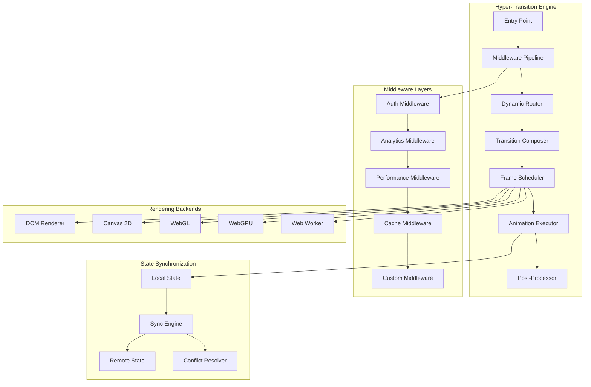

# Hyper-Complex React View Transitions: Enterprise-Grade Architecture

## System Architecture Overview



## 1. Recursive Transition Trees with Virtual Scrolling

Complex nested transitions with millions of items using virtualization:

```btsx

// useViewTransition, forwardRef: no Octane equivalent, dropped from react
import { FixedSizeTree as Tree } from "react-vtree";
import { VariableSizeList as List } from "@octanejs/window";
import { useVirtualizer } from "@octanejs/tanstack-virtual";
import { ViewTransition, useCallback, useMemo, useRef, useState, createContext, useContext, memo, useImperativeHandle, useLayoutEffect, useEffect } from "octane";
module
  // Recursive transition context for tree depth management
  // Recursive transition context for tree depth management
  const TransitionTreeContext = createContext({
    depth: 0,
    path: [],
    registerNode: () => { },
    unregisterNode: () => { },
    getSiblings: () => [],
    getParent: () => null
  });
// Hyper-complex recursive tree with transitions at every level

setup
  const treeRef = useRef(null);
  const [visibleNodes, setVisibleNodes] = useState(new Set());
  const [animatingNodes, setAnimatingNodes] = useState(new Set());
  const { startViewTransition } = useViewTransition();

  // Virtual list configuration
  const virtualizer = useVirtualizer({
    count: data.length,
    getScrollElement: () => treeRef.current,
    estimateSize: useCallback((index) => {
      const node = data[index];
      return node.isExpanded ? 200 : 48;
    }, [data]),
    overscan: 5
  });

  const RecursiveNode = memo(forwardRef(({ node, depth, path, index, parentRef, siblings, isLast, transitionDepth }, ref) => {
    const nodeRef = useRef(null);
    const [isExpanded, setIsExpanded] = useState(expandedNodes.has(node.id));
    const [isSelected, setIsSelected] = useState(selectedNodes.has(node.id));
    const [isAnimating, setIsAnimating] = useState(false);
    const [children, setChildren] = useState([]);
    const [isLoading, setIsLoading] = useState(false);
    useImperativeHandle(ref, () => ({
      expand: () => handleExpand(),
      collapse: () => handleCollapse(),
      select: () => handleSelect(),
      scrollIntoView: () => nodeRef.current?.scrollIntoView()
    }));
    // Async children loading with transition
    const loadChildren = async () => {
      setIsLoading(true);
      const result = await getChildren(node.id);
      setChildren(result);
      setIsLoading(false);
      return result;
    };
    const handleExpand = async () => {
      if (isAnimating || isLoading)
        return;
      setIsAnimating(true);
      setAnimatingNodes((prev) => new Set([...prev, node.id]));
      // Start transition
      startViewTransition(async () => {
        if (!isExpanded) {
          // Load children before expanding
          await loadChildren();
        }
        setIsExpanded(!isExpanded);
        onNodeExpand?.(node, !isExpanded);
        // Update parent about state change
        parentRef?.current?.notifyChildStateChange(node.id, !isExpanded);
      });
      // Wait for transition
      await new Promise((resolve) => setTimeout(resolve, 300));
      setIsAnimating(false);
      setAnimatingNodes((prev) => {
        const next = new Set(prev);
        next.delete(node.id);
        return next;
      });
    };
    const handleCollapse = () => {
      if (!isExpanded || isAnimating)
        return;
      startViewTransition(() => {
        setIsExpanded(false);
        onNodeCollapse?.(node);
      });
    };
    const handleSelect = (e) => {
      e?.stopPropagation();
      startViewTransition(() => {
        setIsSelected(!isSelected);
        onNodeSelect?.(node, !isSelected);
      });
    };
    // Calculate transition properties based on tree position
    const transitionProps = useMemo(() => {
      const delay = depth * 25 + index * 10;
      const duration = Math.max(200, 400 - depth * 30);
      const easing = depth === 0 ? "cubic-bezier(0.4, 0, 0.2, 1)" : "cubic-bezier(0.25, 0.46, 0.45, 0.94)";
      return {
        delay,
        duration,
        easing,
        mode: depth % 2 === 0 ? "layout" : "position"
      };
    }, [depth, index]);
    // Recursive child rendering
    function renderChildre(){
      if (!isExpanded || children.length === 0)
        return null;
      return (<ViewTransition name={`node-children-${node.id}`} mode="layout">
        <div className="node-children" style={{
          paddingLeft: depth < maxDepth ? 24 : 0
        }}>
                {children.map((child, childIndex) => (<RecursiveNode key={child.id} node={child} depth={depth + 1} path={[...path, child.id]} index={childIndex} parentRef={nodeRef} siblings={children} isLast={childIndex === children.length - 1} transitionDepth={transitionDepth + 1}/>))}
        </div>
            </ViewTransition>);
    };
    return (<ViewTransition name={`tree-node-${node.id}`} mode={transitionProps.mode} style={{
        viewTransitionDelay: `${transitionProps.delay}ms`,
        viewTransitionDuration: `${transitionProps.duration}ms`
      }}>
            <div ref={nodeRef} className={`
                  tree-node
                  depth-${depth}
                  ${isExpanded ? "expanded" : ""}
                  ${isSelected ? "selected" : ""}
                  ${isAnimating ? "animating" : ""}
                  ${isLast ? "last" : ""}
                `} data-depth={depth} data-path={path.join("/")}>
        {/* Node header with multiple transition layers */}
        <ViewTransition name={`node-header-${node.id}`}>
                <div className="node-header" onClick={handleSelect}>
          {/* Expand/collapse indicator */}
          {node.hasChildren && (<ViewTransition name={`node-toggle-${node.id}`} mode="position">
            <button className="node-toggle" onClick={handleExpand} disabled={isLoading}>
                        {isLoading ? <Spinner /> : <Chevron rotated={isExpanded}/>}
            </button>
                    </ViewTransition>)}

          {/* Node icon with state-based transition */}
          <ViewTransition name={`node-icon-${node.id}`} mode="layout">
                    <NodeIcon type={node.type} state={isExpanded ? "open" : "closed"} selected={isSelected}/>
          </ViewTransition>

          {/* Node label with text morph */}
          <ViewTransition name={`node-label-${node.id}`} mode="layout">
                    <span className="node-label">{node.label}</span>
          </ViewTransition>

          {/* Node badges */}
          <ViewTransition name={`node-badges-${node.id}`} mode="position">
                    <div className="node-badges">
            {node.badges?.map((badge) => (<Badge key={badge.id} {...badge}/>))}
            {node.childCount > 0 && <span className="child-count">{node.childCount}</span>}
                    </div>
          </ViewTransition>

          {/* Node actions */}
          <ViewTransition name={`node-actions-${node.id}`} mode="position">
                    <NodeActions node={node} onAction={(action) => handleAction(action, node)}/>
          </ViewTransition>
                </div>
        </ViewTransition>

        {/* Node content (expanded state) */}
        {isExpanded && (<ViewTransition name={`node-content-${node.id}`} mode="layout">
          <div className="node-content">
                    {node.content && (<ViewTransition name={`node-detail-${node.id}`}>
                        <NodeDetail content={node.content}/>
            </ViewTransition>)}
                    {renderChildren()}
          </div>
                </ViewTransition>)}
            </div>
      </ViewTransition>);
  }));
TransitionTreeContext(
  ~ value={{
  ~ depth: 0,
  ~ path: [],
  ~ registerNode: () => { },
  ~ unregisterNode: () => { },
  ~ getSiblings: () => data,
  ~ getParent: () => null
  ~ }}
  ~ )
  ViewTransition(name="tree-container")
    .recursive-tree(ref={treeRef})
      div(
        ~ style={{
        ~ height: `${virtualizer.getTotalSize()}px`,
        ~ width: "100%",
        ~ position: "relative"
        ~ }}
        ~ )
        each virtualItem in virtualizer.getVirtualItems() key virtualItem.key
          div(
            ~ style={{
            ~ position: "absolute",
            ~ top: 0,
            ~ left: 0,
            ~ width: "100%",
            ~ height: `${virtualItem.size}px`,
            ~ transform: `translateY(${virtualItem.start}px)`
            ~ }}
            ~ )
            RecursiveNode(
              ~ node={data[virtualItem.index]}
              ~ depth={0}
              ~ path={[data[virtualItem.index].id]}
              ~ index={virtualItem.index}
              ~ parentRef={null}
              ~ siblings={data}
              ~ isLast={virtualItem.index === data.length - 1}
              ~ transitionDepth={0}
              ~ )
```

## 2. Middleware Pipeline with Plugin Architecture

Extensible transition system with middleware chain:

```btsx

// useViewTransition: no Octane equivalent, dropped from react
import { ViewTransition, useCallback, useState, useRef, createContext, useContext } from "octane";
module
  // Middleware types
  const MiddlewarePhase = {
    BEFORE_CAPTURE: "before:capture",
    AFTER_CAPTURE: "after:capture",
    BEFORE_UPDATE: "before:update",
    AFTER_UPDATE: "after:update",
    BEFORE_ANIMATE: "before:animate",
    AFTER_ANIMATE: "after:animate",
    ON_ERROR: "on:error"
  };
  // Middleware registry
  // Middleware registry
  class TransitionMiddlewareRegistry {
    constructor() {
      this.middlewares = new Map();
      this.hooks = new Map();
      this.initializeHooks();
    }
    initializeHooks() {
      Object.values(MiddlewarePhase).forEach((phase) => {
        this.hooks.set(phase, []);
      });
    }
    use(middleware) {
      const { name, phase, handler, priority = 0 } = middleware;
      if (!this.hooks.has(phase)) {
        throw new Error(`Unknown phase: ${phase}`);
      }
      const hooks = this.hooks.get(phase);
      hooks.push({ name, handler, priority });
      hooks.sort((a, b) => b.priority - a.priority);
      this.middlewares.set(name, middleware);
      return this;
    }
    unuse(name) {
      const middleware = this.middlewares.get(name);
      if (!middleware)
        return this;
      const hooks = this.hooks.get(middleware.phase);
      const index = hooks.findIndex((h) => h.name === name);
      if (index > -1) {
        hooks.splice(index, 1);
      }
      this.middlewares.delete(name);
      return this;
    }
    async execute(phase, context) {
      const hooks = this.hooks.get(phase) || [];
      let result = context;
      for (const hook of hooks) {
        try {
          result = await hook.handler(result, phase);
          if (result === null)
            break; // Abort chain
        }
        catch (error) {
          result = await this.execute(MiddlewarePhase.ON_ERROR, {
            ...context,
            error,
            failedPhase: phase,
            failedMiddleware: hook.name
          });
          break;
        }
      }
      return result;
    }
  };
  // Built-in middleware implementations
  const AuthMiddleware = {
    name: "auth",
    phase: MiddlewarePhase.BEFORE_CAPTURE,
    priority: 100,
    handler: async (context) => {
      const { requiresAuth, user } = context;
      if (requiresAuth && !user) {
        context.redirectTo = "/login";
        context.abortTransition = true;
      }
      return context;
    }
  };
  const AnalyticsMiddleware = {
    name: "analytics",
    phase: MiddlewarePhase.AFTER_ANIMATE,
    priority: 10,
    handler: async (context) => {
      const { from, to, duration, metadata } = context;
      // Track transition metrics
      window.gtag?.("event", "view_transition", {
        from_path: from,
        to_path: to,
        duration: duration,
        ...metadata
      });
      return context;
    }
  };
  const PerformanceMiddleware = {
    name: "performance",
    phase: MiddlewarePhase.BEFORE_CAPTURE,
    priority: 90,
    handler: async (context) => {
      context.performanceMarks = {
        start: performance.now(),
        memoryStart: performance.memory?.usedJSHeapSize
      };
      // Check device capabilities
      const deviceTier = getDeviceTier();
      context.shouldAnimate = deviceTier !== "low";
      return context;
    }
  };
  const CacheMiddleware = {
    name: "cache",
    phase: MiddlewarePhase.BEFORE_UPDATE,
    priority: 80,
    handler: async (context) => {
      const { cacheKey, dataFetcher } = context;
      if (cacheKey && dataFetcher) {
        const cached = await getFromCache(cacheKey);
        if (cached && !isStale(cached)) {
          context.prefetchedData = cached.data;
          context.skipFetch = true;
        }
      }
      return context;
    }
  };
  const PrefetchMiddleware = {
    name: "prefetch",
    phase: MiddlewarePhase.AFTER_ANIMATE,
    priority: 5,
    handler: async (context) => {
      const { prefetchRoutes } = context;
      if (prefetchRoutes?.length > 0) {
        prefetchRoutes.forEach((route) => {
          // Prefetch route data
          prefetchRouteData(route);
        });
      }
      return context;
    }
  };
  const ErrorRecoveryMiddleware = {
    name: "errorRecovery",
    phase: MiddlewarePhase.ON_ERROR,
    priority: 1000,
    handler: async (context) => {
      const { error, fallbackView } = context;
      console.error("Transition failed:", error);
      if (fallbackView) {
        context.nextView = fallbackView;
        context.retryCount = (context.retryCount || 0) + 1;
      }
      return context;
    }
  };
  // Hook for using middleware pipeline
  // Hook for using middleware pipeline
  function useMiddlewareTransition(registry) {
    const { startViewTransition } = useViewTransition();
    const [isTransitioning, setIsTransitioning] = useState(false);
    const abortControllerRef = useRef(null);
    const executeTransition = useCallback(async (transitionFn, options = {}) => {
      const abortController = new AbortController();
      abortControllerRef.current = abortController;
      setIsTransitioning(true);
      let context = {
        ...options,
        abortSignal: abortController.signal,
        timestamp: Date.now()
      };
      try {
        // Phase 1: Before capture
        context = await registry.execute(MiddlewarePhase.BEFORE_CAPTURE, context);
        if (context.abortTransition) {
          if (context.redirectTo) {
            window.location.href = context.redirectTo;
          }
          return;
        }
        // Phase 2: After capture
        context = await registry.execute(MiddlewarePhase.AFTER_CAPTURE, context);
        // Phase 3: Before DOM update
        context = await registry.execute(MiddlewarePhase.BEFORE_UPDATE, context);
        // Execute actual transition
        await new Promise((resolve, reject) => {
          startViewTransition(async () => {
            try {
              // Phase 4: DOM update
              await transitionFn(context);
              context = await registry.execute(MiddlewarePhase.AFTER_UPDATE, context);
              resolve();
            }
            catch (error) {
              reject(error);
            }
          });
        });
        // Phase 5: Before animation
        context = await registry.execute(MiddlewarePhase.BEFORE_ANIMATE, context);
        // Wait for animation
        await new Promise((resolve) => setTimeout(resolve, 300));
        // Phase 6: After animation
        context.performanceMarks.end = performance.now();
        context.duration = context.performanceMarks.end - context.performanceMarks.start;
        context = await registry.execute(MiddlewarePhase.AFTER_ANIMATE, context);
        return context;
      }
      catch (error) {
        context = await registry.execute(MiddlewarePhase.ON_ERROR, {
          ...context,
          error
        });
        throw error;
      }
      finally {
        setIsTransitioning(false);
        abortControllerRef.current = null;
      }
    }, [registry, startViewTransition]);
    const abort = useCallback(() => {
      abortControllerRef.current?.abort();
    }, []);
    return {
      executeTransition,
      abort,
      isTransitioning
    };
  }
// Component using middleware pipeline

setup
  const registry = useMemo(() => {
    const reg = new TransitionMiddlewareRegistry();
    reg
      .use(AuthMiddleware)
      .use(PerformanceMiddleware)
      .use(CacheMiddleware)
      .use(AnalyticsMiddleware)
      .use(PrefetchMiddleware)
      .use(ErrorRecoveryMiddleware);
    return reg;
  }, []);

  const { executeTransition, isTransitioning } = useMiddlewareTransition(registry);

  const navigateWithMiddleware = async (path, options = {}) => {
    await executeTransition(() => {
      // Actual navigation
      router.navigate(path);
    }, {
      to: path,
      from: router.currentPath,
      requiresAuth: options.requiresAuth,
      cacheKey: `route:${path}`,
      prefetchRoutes: options.prefetch
    });
  };
.middleware-app
  TransitionStateIndicator(isActive={isTransitioning})
  NavigationMenu(onNavigate={navigateWithMiddleware})
  ViewTransition(name="app-content")
    AppRoutes
```

## 3. Distributed State Synchronization

Multi-tab/window state sync with conflict resolution:

```jsx
import { ViewTransition, useViewTransition, useEffect, useState, useCallback, useRef } from 'react'
import { BroadcastChannel } from 'broadcast-channel'
import { merge as deepMerge } from 'deepmerge'

// Conflict resolution strategies
const ConflictStrategy = {
  LAST_WRITE_WINS: 'lww',
  FIRST_WRITE_WINS: 'fww',
  CUSTOM_MERGE: 'custom',
  MANUAL_RESOLUTION: 'manual'
}

class DistributedTransitionState {
  constructor(options = {}) {
    this.channel = new BroadcastChannel('view-transitions', {
      type: 'native'
    })
    this.peerId = generatePeerId()
    this.state = new Map()
    this.conflicts = new Map()
    this.listeners = new Set()
    this.strategy = options.strategy || ConflictStrategy.LAST_WRITE_WINS
    this.customMerger = options.customMerger

    this.setupChannel()
  }

  setupChannel() {
    this.channel.onmessage = (message) => {
      this.handleRemoteMessage(message)
    }

    // Announce presence
    this.broadcast({
      type: 'PEER_JOIN',
      peerId: this.peerId,
      timestamp: Date.now()
    })
  }

  handleRemoteMessage(message) {
    switch (message.type) {
      case 'STATE_UPDATE':
        this.handleRemoteStateUpdate(message)
        break
      case 'TRANSITION_START':
        this.handleRemoteTransitionStart(message)
        break
      case 'TRANSITION_COMPLETE':
        this.handleRemoteTransitionComplete(message)
        break
      case 'CONFLICT_DETECTED':
        this.handleConflictDetected(message)
        break
      case 'PEER_JOIN':
        this.syncStateToPeer(message.peerId)
        break
      case 'STATE_SYNC':
        this.mergeRemoteState(message.state)
        break
    }
  }

  handleRemoteStateUpdate(message) {
    const { key, value, timestamp, peerId, vectorClock } = message

    // Check for conflicts using vector clocks
    const localEntry = this.state.get(key)
    if (localEntry) {
      const conflict = this.detectConflict(localEntry, {
        timestamp,
        vectorClock
      })

      if (conflict) {
        this.resolveConflict(key, localEntry, {
          value,
          timestamp,
          peerId,
          vectorClock
        })
        return
      }
    }

    // No conflict, apply update
    this.state.set(key, {
      value,
      timestamp,
      peerId,
      vectorClock
    })

    this.notifyListeners(key, value, 'remote')
  }

  detectConflict(localEntry, remoteEntry) {
    // Vector clock comparison
    const comparison = compareVectorClocks(localEntry.vectorClock, remoteEntry.vectorClock)

    // If clocks are concurrent, we have a conflict
    return comparison === 'concurrent'
  }

  resolveConflict(key, localEntry, remoteEntry) {
    const conflictId = `${key}:${Date.now()}`
    this.conflicts.set(conflictId, {
      key,
      local: localEntry,
      remote: remoteEntry,
      timestamp: Date.now()
    })

    let resolved

    switch (this.strategy) {
      case ConflictStrategy.LAST_WRITE_WINS:
        resolved = remoteEntry.timestamp > localEntry.timestamp ? remoteEntry : localEntry
        break
      case ConflictStrategy.FIRST_WRITE_WINS:
        resolved = remoteEntry.timestamp < localEntry.timestamp ? remoteEntry : localEntry
        break
      case ConflictStrategy.CUSTOM_MERGE:
        resolved = this.customMerger(localEntry, remoteEntry)
        break
      case ConflictStrategy.MANUAL_RESOLUTION:
        // Emit conflict for manual resolution
        this.notifyListeners('conflict', {
          id: conflictId,
          key,
          local: localEntry,
          remote: remoteEntry
        })
        return
    }

    this.state.set(key, resolved)
    this.broadcast({
      type: 'CONFLICT_RESOLVED',
      conflictId,
      winner: resolved.peerId
    })

    this.notifyListeners(key, resolved.value, 'resolved')
  }

  set(key, value, metadata = {}) {
    const entry = {
      value,
      timestamp: Date.now(),
      peerId: this.peerId,
      vectorClock: this.incrementVectorClock(),
      metadata
    }

    this.state.set(key, entry)

    this.broadcast({
      type: 'STATE_UPDATE',
      key,
      ...entry
    })

    this.notifyListeners(key, value, 'local')
  }

  get(key) {
    const entry = this.state.get(key)
    return entry?.value
  }

  startTransition(transitionId, config) {
    this.broadcast({
      type: 'TRANSITION_START',
      transitionId,
      peerId: this.peerId,
      config,
      timestamp: Date.now()
    })

    return {
      update: (state) => {
        this.broadcast({
          type: 'TRANSITION_UPDATE',
          transitionId,
          state
        })
      },
      complete: (result) => {
        this.broadcast({
          type: 'TRANSITION_COMPLETE',
          transitionId,
          result
        })
      }
    }
  }

  broadcast(message) {
    this.channel.postMessage({
      ...message,
      senderId: this.peerId
    })
  }

  subscribe(listener) {
    this.listeners.add(listener)
    return () => this.listeners.delete(listener)
  }

  notifyListeners(key, value, source) {
    this.listeners.forEach((listener) => {
      try {
        listener(key, value, source)
      } catch (e) {
        console.error('Listener error:', e)
      }
    })
  }

  destroy() {
    this.channel.close()
    this.listeners.clear()
    this.state.clear()
    this.conflicts.clear()
  }
}

// Hook for distributed transitions
function useDistributedTransition(channelName = 'default') {
  const [syncState, setSyncState] = useState(new Map())
  const [conflicts, setConflicts] = useState([])
  const [peers, setPeers] = useState(new Set())
  const distributedRef = useRef(null)
  const { startViewTransition } = useViewTransition()

  useEffect(() => {
    distributedRef.current = new DistributedTransitionState({
      strategy: ConflictStrategy.CUSTOM_MERGE,
      customMerger: (local, remote) => {
        // Deep merge for objects
        if (typeof local.value === 'object' && typeof remote.value === 'object') {
          return {
            value: deepMerge(local.value, remote.value),
            timestamp: Math.max(local.timestamp, remote.timestamp),
            peerId: local.timestamp > remote.timestamp ? local.peerId : remote.peerId
          }
        }
        return local.timestamp > remote.timestamp ? local : remote
      }
    })

    const unsubscribe = distributedRef.current.subscribe((key, value, source) => {
      setSyncState((prev) => new Map([...prev, [key, value]]))

      if (key === 'conflict') {
        setConflicts((prev) => [...prev, value])
      }
    })

    return () => {
      unsubscribe()
      distributedRef.current?.destroy()
    }
  }, [channelName])

  const syncTransition = useCallback(
    async (key, transitionFn, options = {}) => {
      const transitionId = `${key}:${Date.now()}`
      const controller = distributedRef.current.startTransition(transitionId, options)

      return new Promise((resolve, reject) => {
        startViewTransition(async () => {
          try {
            const result = await transitionFn()
            controller.complete({ success: true, result })
            distributedRef.current.set(key, result, {
              transitionId
            })
            resolve(result)
          } catch (error) {
            controller.complete({ success: false, error })
            reject(error)
          }
        })
      })
    },
    [startViewTransition]
  )

  const resolveConflict = useCallback((conflictId, winner) => {
    // Manual conflict resolution
    distributedRef.current.broadcast({
      type: 'CONFLICT_MANUAL_RESOLVE',
      conflictId,
      winner
    })
    setConflicts((prev) => prev.filter((c) => c.id !== conflictId))
  }, [])

  return {
    syncState,
    conflicts,
    peers,
    syncTransition,
    resolveConflict,
    set: (key, value) => distributedRef.current?.set(key, value),
    get: (key) => distributedRef.current?.get(key)
  }
}

// Component using distributed state


setup
  const { syncState, conflicts, syncTransition, resolveConflict, set, get } = useDistributedTransition("canvas");
  const [elements, setElements] = useState([]);
  const [activeElement, setActiveElement] = useState(null);

  const addElement = async (type, position) => {
    const newElement = {
      id: generateId(),
      type,
      position,
      createdBy: "local",
      timestamp: Date.now()
    };
    await syncTransition(`element:${newElement.id}`, () => {
      setElements((prev) => [...prev, newElement]);
      return newElement;
    }, { type: "CREATE", elementType: type });
  };

  const moveElement = async (id, newPosition) => {
    await syncTransition(`element:${id}`, () => {
      setElements((prev) => prev.map((el) => (el.id === id ? { ...el, position: newPosition } : el)));
      return { id, position: newPosition };
    }, { type: "MOVE", elementId: id });
  };
.collaborative-canvas
  ConflictPanel(conflicts={conflicts} onResolve={resolveConflict})
  PeerIndicator(peers={peers})
  ViewTransition(name="canvas-container")
    .canvas
      each element in elements key element.id
        ViewTransition(name={`canvas-element-${element.id}`} mode="layout")
          CanvasElement(
            ~ element={element}
            ~ isRemote={element.createdBy !== "local"}
            ~ onMove={(pos) => moveElement(element.id, pos)}
            ~ )

```

## 4. WebGL-Accelerated Transitions

Hardware-accelerated transitions using WebGL:

```btsx

// useViewTransition: no Octane equivalent, dropped from react
import { ViewTransition, useRef, useEffect, useCallback, useState } from "octane";
module
  // WebGL transition shader programs
  // WebGL transition shader programs
  const VERTEX_SHADER = `
    attribute vec2 position;
    attribute vec2 uv;
    varying vec2 vUv;

    void main() {
      vUv = uv;
      gl_Position = vec4(position, 0.0, 1.0);
    }
  `;
  const FRAGMENT_SHADER_MORPH = `
    precision highp float;

    varying vec2 vUv;
    uniform sampler2D fromTexture;
    uniform sampler2D toTexture;
    uniform float progress;
    uniform float intensity;
    uniform vec2 resolution;

    // Noise function for organic transitions
    float noise(vec2 p) {
      return fract(sin(dot(p, vec2(12.9898, 78.233))) * 43758.5453);
    }

    // Displacement based on image content
    vec2 getDisplacement(sampler2D tex, vec2 uv, float scale) {
      vec4 color = texture2D(tex, uv);
      float brightness = dot(color.rgb, vec3(0.299, 0.587, 0.114));
      float angle = brightness * 6.28;
      return vec2(cos(angle), sin(angle)) * scale;
    }

    void main() {
      vec2 uv = vUv;

      // Calculate displacement based on both textures
      vec2 fromDisp = getDisplacement(fromTexture, uv, intensity * (1.0 - progress));
      vec2 toDisp = getDisplacement(toTexture, uv, intensity * progress);

      // Add noise for organic feel
      float n = noise(uv * 10.0 + progress * 5.0) * 0.02;

      // Sample both textures with displacement
      vec2 fromUV = uv + fromDisp * (1.0 - progress) + n;
      vec2 toUV = uv - toDisp * progress - n;

      vec4 fromColor = texture2D(fromTexture, fromUV);
      vec4 toColor = texture2D(toTexture, toUV);

      // Blend based on progress with edge detection
      float edge = smoothstep(0.4, 0.6, progress + length(fromDisp) * 0.5);

      // Add glow effect during transition
      vec3 glow = vec3(0.0);
      if (abs(progress - 0.5) < 0.1) {
        glow = vec3(0.3, 0.5, 1.0) * (0.1 - abs(progress - 0.5));
      }

      vec3 finalColor = mix(fromColor.rgb, toColor.rgb, edge) + glow;
      float alpha = mix(fromColor.a, toColor.a, edge);

      gl_FragColor = vec4(finalColor, alpha);
    }
  `;
  const FRAGMENT_SHADER_PIXELATE = `
    precision highp float;

    varying vec2 vUv;
    uniform sampler2D fromTexture;
    uniform sampler2D toTexture;
    uniform float progress;
    uniform float pixelSize;
    uniform vec2 resolution;

    vec2 pixelate(vec2 uv, float size) {
      return floor(uv * size) / size;
    }

    void main() {
      float p = progress;
      float size = mix(1.0, pixelSize, sin(p * 3.14159));

      vec2 uv1 = pixelate(vUv, size);
      vec2 uv2 = pixelate(vUv, size * 0.5);

      vec4 fromColor = texture2D(fromTexture, uv1);
      vec4 toColor = texture2D(toTexture, uv2);

      float noise = fract(sin(dot(vUv, vec2(12.9898, 78.233))) * 43758.5453);
      float threshold = smoothstep(0.0, 1.0, p + noise * 0.1 - 0.05);

      gl_FragColor = mix(fromColor, toColor, threshold);
    }
  `;
  // WebGL context manager
  class WebGLTransitionContext {
    constructor(canvas) {
      this.canvas = canvas;
      this.gl = canvas.getContext("webgl2", {
        alpha: true,
        antialias: false,
        preserveDrawingBuffer: true
      });
      if (!this.gl) {
        throw new Error("WebGL2 not supported");
      }
      this.programs = new Map();
      this.framebuffers = new Map();
      this.textures = new Map();
      this.init();
    }
    init() {
      // Create default programs
      this.createProgram("morph", VERTEX_SHADER, FRAGMENT_SHADER_MORPH);
      this.createProgram("pixelate", VERTEX_SHADER, FRAGMENT_SHADER_PIXELATE);
      // Setup geometry
      this.setupGeometry();
    }
    createProgram(name, vertexSrc, fragmentSrc) {
      const gl = this.gl;
      const vertexShader = gl.createShader(gl.VERTEX_SHADER);
      gl.shaderSource(vertexShader, vertexSrc);
      gl.compileShader(vertexShader);
      const fragmentShader = gl.createShader(gl.FRAGMENT_SHADER);
      gl.shaderSource(fragmentShader, fragmentSrc);
      gl.compileShader(fragmentShader);
      const program = gl.createProgram();
      gl.attachShader(program, vertexShader);
      gl.attachShader(program, fragmentShader);
      gl.linkProgram(program);
      this.programs.set(name, {
        program,
        attributes: {
          position: gl.getAttribLocation(program, "position"),
          uv: gl.getAttribLocation(program, "uv")
        },
        uniforms: {
          fromTexture: gl.getUniformLocation(program, "fromTexture"),
          toTexture: gl.getUniformLocation(program, "toTexture"),
          progress: gl.getUniformLocation(program, "progress"),
          intensity: gl.getUniformLocation(program, "intensity"),
          resolution: gl.getUniformLocation(program, "resolution"),
          pixelSize: gl.getUniformLocation(program, "pixelSize")
        }
      });
    }
    setupGeometry() {
      const gl = this.gl;
      // Full-screen quad
      const positions = new Float32Array([-1, -1, 1, -1, -1, 1, 1, 1]);
      const uvs = new Float32Array([0, 0, 1, 0, 0, 1, 1, 1]);
      this.positionBuffer = gl.createBuffer();
      gl.bindBuffer(gl.ARRAY_BUFFER, this.positionBuffer);
      gl.bufferData(gl.ARRAY_BUFFER, positions, gl.STATIC_DRAW);
      this.uvBuffer = gl.createBuffer();
      gl.bindBuffer(gl.ARRAY_BUFFER, this.uvBuffer);
      gl.bufferData(gl.ARRAY_BUFFER, uvs, gl.STATIC_DRAW);
    }
    createTexture(image) {
      const gl = this.gl;
      const texture = gl.createTexture();
      gl.bindTexture(gl.TEXTURE_2D, texture);
      gl.texImage2D(gl.TEXTURE_2D, 0, gl.RGBA, gl.RGBA, gl.UNSIGNED_BYTE, image);
      gl.texParameteri(gl.TEXTURE_2D, gl.TEXTURE_WRAP_S, gl.CLAMP_TO_EDGE);
      gl.texParameteri(gl.TEXTURE_2D, gl.TEXTURE_WRAP_T, gl.CLAMP_TO_EDGE);
      gl.texParameteri(gl.TEXTURE_2D, gl.TEXTURE_MIN_FILTER, gl.LINEAR);
      gl.texParameteri(gl.TEXTURE_2D, gl.TEXTURE_MAG_FILTER, gl.LINEAR);
      return texture;
    }
    captureElement(element) {
      // Use html2canvas or similar to capture element
      return html2canvas(element, {
        backgroundColor: null,
        scale: 1,
        logging: false
      }).then((canvas) => {
        return this.createTexture(canvas);
      });
    }
    renderTransition(fromTexture, toTexture, progress, effect = "morph") {
      const gl = this.gl;
      const programInfo = this.programs.get(effect);
      gl.useProgram(programInfo.program);
      // Set uniforms
      gl.activeTexture(gl.TEXTURE0);
      gl.bindTexture(gl.TEXTURE_2D, fromTexture);
      gl.uniform1i(programInfo.uniforms.fromTexture, 0);
      gl.activeTexture(gl.TEXTURE1);
      gl.bindTexture(gl.TEXTURE_2D, toTexture);
      gl.uniform1i(programInfo.uniforms.toTexture, 1);
      gl.uniform1f(programInfo.uniforms.progress, progress);
      gl.uniform2f(programInfo.uniforms.resolution, this.canvas.width, this.canvas.height);
      if (effect === "morph") {
        gl.uniform1f(programInfo.uniforms.intensity, 0.1);
      }
      else if (effect === "pixelate") {
        gl.uniform1f(programInfo.uniforms.pixelSize, 50.0);
      }
      // Bind attributes
      gl.bindBuffer(gl.ARRAY_BUFFER, this.positionBuffer);
      gl.enableVertexAttribArray(programInfo.attributes.position);
      gl.vertexAttribPointer(programInfo.attributes.position, 2, gl.FLOAT, false, 0, 0);
      gl.bindBuffer(gl.ARRAY_BUFFER, this.uvBuffer);
      gl.enableVertexAttribArray(programInfo.attributes.uv);
      gl.vertexAttribPointer(programInfo.attributes.uv, 2, gl.FLOAT, false, 0, 0);
      // Draw
      gl.drawArrays(gl.TRIANGLE_STRIP, 0, 4);
    }
    animate(fromElement, toElement, duration = 500, effect = "morph") {
      return new Promise(async (resolve) => {
        const startTime = performance.now();
        // Capture both states
        const [fromTexture, toTexture] = await Promise.all([
          this.captureElement(fromElement),
          this.captureElement(toElement)
        ]);
        // Show canvas
        this.canvas.style.display = "block";
        const frame = () => {
          const elapsed = performance.now() - startTime;
          const progress = Math.min(elapsed / duration, 1);
          const easedProgress = this.easeInOutCubic(progress);
          this.renderTransition(fromTexture, toTexture, easedProgress, effect);
          if (progress < 1) {
            requestAnimationFrame(frame);
          }
          else {
            // Cleanup
            this.canvas.style.display = "none";
            gl.deleteTexture(fromTexture);
            gl.deleteTexture(toTexture);
            resolve();
          }
        };
        requestAnimationFrame(frame);
      });
    }
    easeInOutCubic(t) {
      return t < 0.5 ? 4 * t * t * t : 1 - Math.pow(-2 * t + 2, 3) / 2;
    }
    destroy() {
      const gl = this.gl;
      this.programs.forEach(({ program }) => {
        gl.deleteProgram(program);
      });
      this.textures.forEach((texture) => {
        gl.deleteTexture(texture);
      });
    }
  };
  // Hook for WebGL transitions
  function useWebGLTransition() {
    const canvasRef = useRef(null);
    const glContextRef = useRef(null);
    const { startViewTransition } = useViewTransition();
    useEffect(() => {
      if (canvasRef.current && !glContextRef.current) {
        glContextRef.current = new WebGLTransitionContext(canvasRef.current);
      }
      return () => {
        glContextRef.current?.destroy();
      };
    }, []);
    const webglTransition = useCallback(async (fromRef, toRef, options = {}) => {
      const { duration = 500, effect = "morph", fallback = true } = options;
      if (!glContextRef.current) {
        if (fallback) {
          // Fall back to standard transition
          return new Promise((resolve) => {
            startViewTransition(() => {
              resolve();
            });
          });
        }
        throw new Error("WebGL not available");
      }
      // Perform WebGL transition
      await glContextRef.current.animate(fromRef.current, toRef.current, duration, effect);
    }, [startViewTransition]);
    return {
      canvasRef,
      webglTransition,
      isSupported: !!glContextRef.current
    };
  }
// Component using WebGL transitions

setup
  const { canvasRef, webglTransition } = useWebGLTransition();
  const [activeIndex, setActiveIndex] = useState(0);
  const [isTransitioning, setIsTransitioning] = useState(false);
  const currentRef = useRef(null);
  const nextRef = useRef(null);

  const items = [
    { id: 1, type: "image", src: "/img1.jpg" },
    { id: 2, type: "video", src: "/vid1.mp4" },
    { id: 3, type: "3d", src: "/model1.glb" }
  ];

  const navigate = async (direction) => {
    if (isTransitioning)
      return;
    setIsTransitioning(true);
    const nextIndex = (activeIndex + direction + items.length) % items.length;
    await webglTransition(currentRef, nextRef, {
      duration: 800,
      effect: direction > 0 ? "morph" : "pixelate"
    });
    setActiveIndex(nextIndex);
    setIsTransitioning(false);
  };
.webgl-gallery
  canvas.webgl-canvas(ref={canvasRef} style={{ display: "none" }})
  ViewTransition(name="gallery-container")
    .gallery-stage
      .current-item(ref={currentRef})
        MediaItem(item={items[activeIndex]})
      .next-item(ref={nextRef})
        MediaItem(item={items[(activeIndex + 1) % items.length]})
  NavigationControls(
    ~ onPrev={() => navigate(-1)}
    ~ onNext={() => navigate(1)}
    ~ disabled={isTransitioning}
    ~ )

```

## 5. Multi-Dimensional Transition Space

Transitions across multiple axes simultaneously:

```btsx

// useViewTransition: no Octane equivalent, dropped from react
import { ViewTransition, useState, useCallback, useMemo, useRef } from "octane";
module
  function easeOutExpo(x) {
    return x === 1 ? 1 : 1 - Math.pow(2, -10 * x);
  }
// 4D transition: X, Y, Z (scale), W (time/morph)
component MultiDimensionalTransition
  setup
    const [dimensions, setDimensions] = useState({
      x: 0,
      y: 0,
      z: 1,
      w: 0
    });

    const [targetDimensions, setTargetDimensions] = useState(null);
    const { startViewTransition } = useViewTransition();
    const transitionQueue = useRef([]);

    // Calculate transformation matrix
    const transformMatrix = useMemo(() => {
      const { x, y, z, w } = dimensions;
      return `
          translate3d(${x}px, ${y}px, 0)
          scale(${z})
          rotateX(${w * 15}deg)
          rotateY(${w * 10}deg)
        `;
    }, [dimensions]);

    // Interpolate between dimensions
    const interpolateDimensions = (from, to, progress) => {
      return {
        x: from.x + (to.x - from.x) * progress,
        y: from.y + (to.y - from.y) * progress,
        z: from.z + (to.z - from.z) * progress,
        w: from.w + (to.w - from.w) * progress
      };
    };

    // Queue transition for sequential execution
    const queueTransition = useCallback((dimensionUpdates, options = {}) => {
      const transition = {
        target: { ...dimensions, ...dimensionUpdates },
        options,
        id: Date.now()
      };
      transitionQueue.current.push(transition);
      processQueue();
    }, [dimensions]);

    const processQueue = useCallback(async () => {
      if (transitionQueue.current.length === 0)
        return;
      const { target, options } = transitionQueue.current[0];
      const startDimensions = { ...dimensions };
      const startTime = performance.now();
      const duration = options.duration || 500;
      await startViewTransition(() => {
        const animate = () => {
          const elapsed = performance.now() - startTime;
          const progress = Math.min(elapsed / duration, 1);
          const eased = easeOutExpo(progress);
          const newDimensions = interpolateDimensions(startDimensions, target, eased);
          setDimensions(newDimensions);
          if (progress < 1) {
            requestAnimationFrame(animate);
          }
          else {
            transitionQueue.current.shift();
            processQueue();
          }
        };
        requestAnimationFrame(animate);
      });
    }, [dimensions, startViewTransition]);

    const navigate4D = useCallback((direction) => {
      const step = 200;
      const updates = {};
      switch (direction) {
        case "left":
          updates.x = dimensions.x - step;
          break;
        case "right":
          updates.x = dimensions.x + step;
          break;
        case "up":
          updates.y = dimensions.y - step;
          break;
        case "down":
          updates.y = dimensions.y + step;
          break;
        case "in":
          updates.z = dimensions.z * 1.5;
          updates.w = dimensions.w + 0.1;
          break;
        case "out":
          updates.z = dimensions.z / 1.5;
          updates.w = dimensions.w - 0.1;
          break;
      }
      queueTransition(updates, { duration: 600 });
    }, [dimensions, queueTransition]);

    // Calculate visible items based on 4D position
    const visibleItems = useMemo(() => {
      return items.filter((item) => {
        const distance = Math.sqrt(Math.pow(item.x - dimensions.x, 2) + Math.pow(item.y - dimensions.y, 2));
        const scaleDiff = Math.abs(item.scale - dimensions.z);
        const timeDiff = Math.abs(item.time - dimensions.w);
        return distance < 500 && scaleDiff < 0.5 && timeDiff < 0.3;
      });
    }, [dimensions, items]);
  .multi-dim-container
    ViewTransition(name="dim-space")
      .dimensional-space(
        ~ style={{
        ~ transform: transformMatrix,
        ~ transformStyle: "preserve-3d"
        ~ }}
        ~ )
        each item in visibleItems key item.id
          ViewTransition(name={`dim-item-${item.id}`} mode="layout")
            DimensionalItem(
              ~ item={item}
              ~ currentDimensions={dimensions}
              ~ onActivate={() => queueTransition({
              ~ x: item.x,
              ~ y: item.y,
              ~ z: item.scale,
              ~ w: item.time
              ~ }, { duration: 800 })}
              ~ )
    DimensionalControls(onNavigate={navigate4D})
    DimensionIndicator(dimensions={dimensions})
component DimensionalItem
  setup
    const relativeX = item.x - currentDimensions.x;
    const relativeY = item.y - currentDimensions.y;
    const relativeScale = item.scale / currentDimensions.z;
    const relativeTime = item.time - currentDimensions.w;

    const itemTransform = `
        translate3d(${relativeX}px, ${relativeY}px, ${relativeTime * 100}px)
        scale(${relativeScale})
        rotateX(${relativeTime * 30}deg)
      `;

    const opacity = Math.max(0, 1 - Math.abs(relativeTime) * 2);
  ViewTransition(name={`item-content-${item.id}`})
    .dimensional-item(
      ~ style={{
      ~ transform: itemTransform,
      ~ opacity
      ~ }}
      ~ onClick={onActivate}
      ~ )
      ViewTransition(name={`item-visual-${item.id}`})
        .item-visual
          if item.type === "image"
            img(src={item.src} alt={item.title})
          if item.type === "video"
            video(src={item.src} muted loop)
          if item.type === "data"
            DataVisualization(data={item.data})
      ViewTransition(name={`item-meta-${item.id}`})
        .item-meta
          h3 #{item.title}
          p #{item.description}
          DimensionalCoords(x={item.x} y={item.y} z={item.scale} w={item.time})
```

These hyper-complex examples demonstrate production-grade patterns for massive scale applications with recursive structures, middleware pipelines, distributed state, hardware acceleration, and multi-dimensional navigation.
