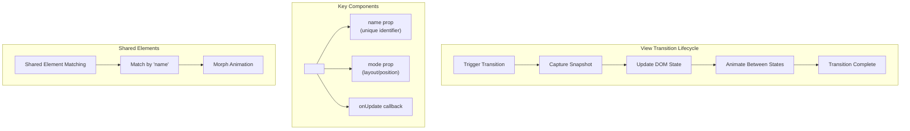
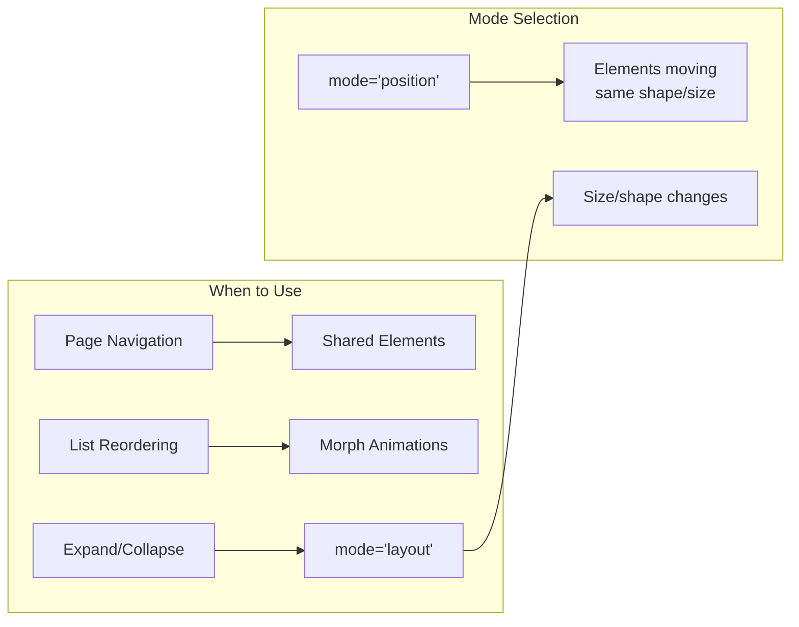

React's View Transitions API (introduced in React 19) provides a declarative way to animate between different states of your UI. Here's a comprehensive guide to help you master it.

## What is View Transitions?

The View Transitions API allows you to create smooth, animated transitions between different visual states of your application—like navigating between pages, expanding cards, or reordering lists.

## Core Concepts



## Basic Usage

### 1. Simple View Transition

```btsx

import { ViewTransition } from "octane";

setup const [showDetails, setShowDetails] = useState(false);
div
  button(onClick={() => setShowDetails(!showDetails)}) Toggle Details
  ViewTransition(name="card")
    if showDetails
      DetailedCard
    else
      CompactCard

```

### 2. Page Navigation with View Transitions

```btsx

// useNavigate: no Octane equivalent, dropped from react
import { ViewTransition } from "octane";
component ProductList
  setup const navigate = useNavigate();
  .product-grid
    each product in products key product.id
      ViewTransition(name={`product-${product.id}`} mode="position")
        ProductCard(product={product} onClick={() => navigate(`/product/${product.id}`)})
component ProductDetail
  ViewTransition(name={`product-${product.id}`} mode="position")
    .product-detail
      h1 #{product.name}
      img(src={product.image} alt={product.name})
      p #{product.description}

```

## Advanced Patterns

### 3. List Reordering with Animations

```btsx

import { ViewTransition } from "octane";

setup
  const [sortedItems, setSortedItems] = useState(items);

  const sortBy = (key) => {
    const sorted = [...sortedItems].sort((a, b) => a[key].localeCompare(b[key]));
    setSortedItems(sorted);
  };
div
  button(onClick={() => sortBy("name")}) Sort by Name
  button(onClick={() => sortBy("date")}) Sort by Date
  ul
    each item in sortedItems key item.id
      ViewTransition(name={`list-item-${item.id}`} mode="layout")
        li #{item.name}

```

### 4. Custom Transition with onUpdate

```btsx

// useViewTransition: no Octane equivalent, dropped from react
import { ViewTransition } from "octane";

setup
  const [selectedImage, setSelectedImage] = useState(null);
  const { startViewTransition } = useViewTransition();

  const handleSelect = (image) => {
    // Custom transition with callback
    startViewTransition(() => {
      setSelectedImage(image);
    });
  };
div
  if selectedImage
    ViewTransition(
      ~ name={`image-${selectedImage.id}`}
      ~ onUpdate={(instance) => {
      ~ instance.ready.then(() => {
      ~ console.log("Transition ready");
      ~ });
      ~ instance.finished.then(() => {
      ~ console.log("Transition finished");
      ~ });
      ~ }}
      ~ )
      ExpandedImage(image={selectedImage} onClose={() => setSelectedImage(null)})
  else
    .gallery
      each image in images key image.id
        ViewTransition(name={`image-${image.id}`} mode="position")
          Thumbnail(image={image} onClick={() => handleSelect(image)})

```

### 5. Nested View Transitions

```btsx

import { ViewTransition } from "octane";

setup const [activePanel, setActivePanel] = useState("overview");
ViewTransition(name="dashboard")
  .dashboard
    ViewTransition(name="sidebar")
      Sidebar(activePanel={activePanel} onSelect={setActivePanel})
    ViewTransition(name="main-content")
      main
        if activePanel === "overview"
          ViewTransition(name="overview-panel")
            OverviewPanel
        if activePanel === "analytics"
          ViewTransition(name="analytics-panel")
            AnalyticsPanel

```

## CSS Integration

### 6. Customizing Animations with CSS

```css
/* Default view transition animations */
::view-transition-old(root) {
  animation: fade-out 300ms ease-out;
}

::view-transition-new(root) {
  animation: fade-in 300ms ease-in;
}

/* Custom named transitions */
::view-transition-old(product-card),
::view-transition-new(product-card) {
  animation-duration: 500ms;
  animation-timing-function: cubic-bezier(0.4, 0, 0.2, 1);
}

/* Specific element animations */
::view-transition-image(product-image) {
  animation: scale-up 400ms ease-out;
}

@keyframes fade-out {
  from {
    opacity: 1;
  }
  to {
    opacity: 0;
  }
}

@keyframes fade-in {
  from {
    opacity: 0;
  }
  to {
    opacity: 1;
  }
}

@keyframes scale-up {
  from {
    transform: scale(0.8);
    opacity: 0;
  }
  to {
    transform: scale(1);
    opacity: 1;
  }
}
```

## Best Practices

| Practice                             | Description                                                 |
| ------------------------------------ | ----------------------------------------------------------- |
| **Use unique names**                 | Each `name` prop should be unique and stable across renders |
| **Match names across views**         | For shared elements, use the same `name` in both states     |
| **Prefer `mode="position"`**         | For elements that change position but not size/shape        |
| **Use `mode="layout"`**              | For elements that change size, shape, or position           |
| **Keep transitions short**           | 200-500ms is ideal for most transitions                     |
| **Respect `prefers-reduced-motion`** | Disable animations for accessibility                        |

### 7. Accessibility Considerations

```jsx
import { ViewTransition } from 'react'

function AccessibleTransition({ children, name }) {
  const prefersReducedMotion =
    typeof window !== 'undefined' ? window.matchMedia('(prefers-reduced-motion: reduce)').matches : false

  if (prefersReducedMotion) {
    return children // Skip animation
  }

  return (
    <ViewTransition name={name} mode='layout'>
      {children}
    </ViewTransition>
  )
}
```

## Common Patterns Summary



## Key Takeaways

1. **Name matching is crucial** — Elements with the same `name` prop will animate between each other
2. **Modes matter** — Choose `position` for movement, `layout` for structural changes
3. **CSS enhances control** — Use `::view-transition-*` pseudo-elements for custom animations
4. **Performance** — The browser handles the animation off-main-thread for smooth 60fps
5. **Progressive enhancement** — Works with or without JavaScript enabled

Would you like me to dive deeper into any specific aspect, such as integrating with React Router, handling complex nested transitions, or performance optimization techniques?
